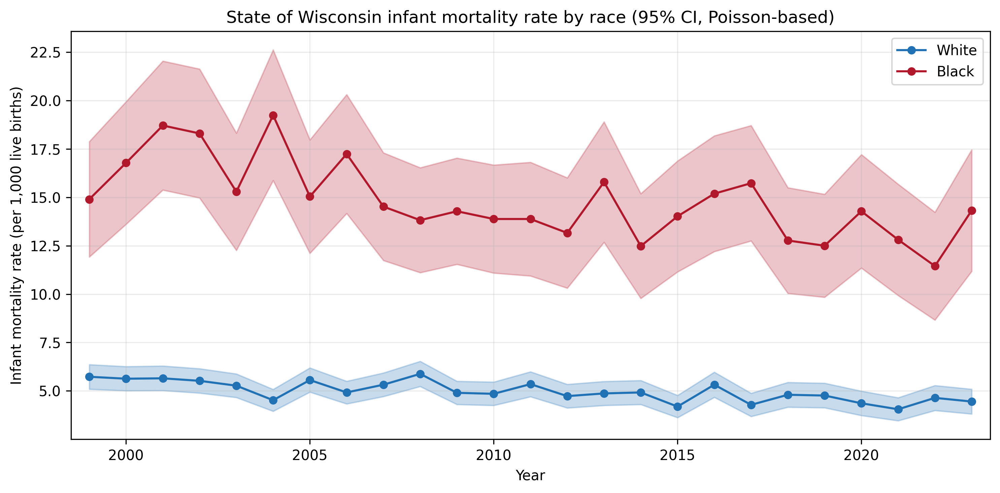
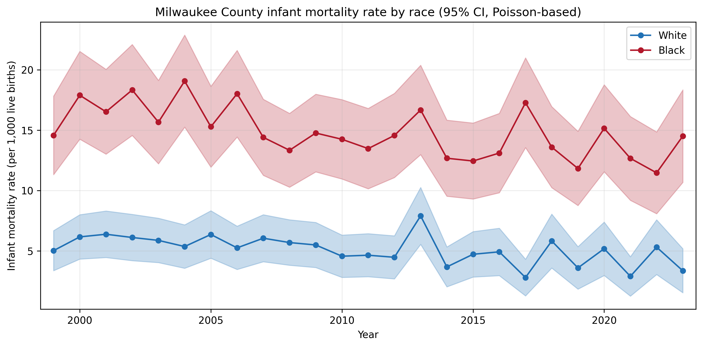
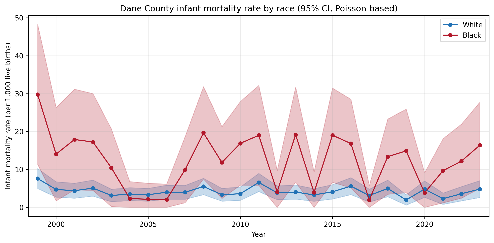
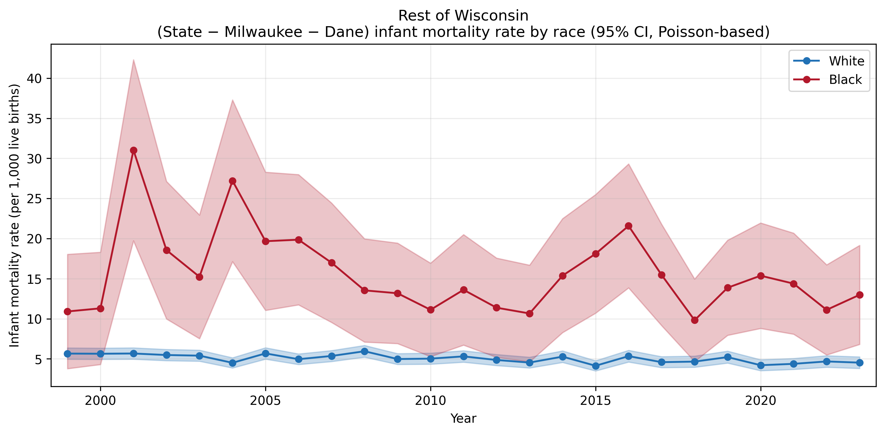

## Overview

1. Wisconsin has among the worst Black--White infant mortality disparities in the U.S.
2. Evidence-based interventions can achieve meaningful reductions
3. Milwaukee is the only county-level setting where effects are detectable
4. The Birth Equity Act proposes seven bills aligned with the evidence

::: {.notes}
This presentation summarizes the report: rates by race and geography, the evidence base, detectability, and the Birth Equity Act.
:::

## The Disparity

- In 2023, Wisconsin's Black infant mortality rate was **14.3 per 1,000** compared with **4.4 for White infants** --- a more than threefold gap
- Wisconsin has had one of the worst Black infant mortality rates among U.S. states [@Tomlin2021_wisconsin]
- Nationally, Black infant mortality is about twice the White rate; Wisconsin's gap is worse [@KFF2025_disparities]

**Drivers:** higher rates of premature birth among Black infants *and* higher mortality among term Black infants (SIDS, accidents, assaults)

## Rates by Geography and Race (2019--2023)

| Geography | Race | Rate | 95% CI | Deaths/yr |
|-----------|------|------|--------|-----------|
| State | White | 4.45 | 3.8--5.1 | 192 |
| State | Black | 13.07 | 10.1--15.9 | 79 |
| Milwaukee | White | 4.05 | 2.2--6.1 | 17 |
| Milwaukee | Black | 13.12 | 9.7--16.6 | 55 |
| Dane | White | 3.47 | 1.7--5.4 | 14 |
| Dane | Black | 11.24 | 2.4--21.7 | 6 |
| Rest of WI | White | 4.61 | 3.9--5.3 | 162 |
| Rest of WI | Black | 13.56 | 7.5--19.9 | 19 |

Black infant mortality is about three times White in every geography.

## State of Wisconsin: Rates Over Time

{fig-align="center" width="85%"}

## Milwaukee County: Rates Over Time

{fig-align="center" width="85%"}

Milwaukee has ~4,190 Black births and ~55 Black infant deaths per year --- the largest concentration in Wisconsin.

## Dane County and Rest of Wisconsin

::: {layout-ncol=2}
{width="100%"}

{width="100%"}
:::

Wide confidence intervals reflect small numbers of Black infant deaths outside Milwaukee.

## Evidence: What Reduces Infant Mortality?

| Intervention | Effect | Cost |
|-------------|--------|------|
| Nurse-Family Partnership | ~500 deaths (projected U.S.) | ~0.31 lives/\$1M |
| Denmark SIDS campaign | 17.2% reduction | Not reported |
| Immediate KMC | 58 in trial; ~150k/yr scale | Low (LMICs) |
| Back to Sleep (U.S.) | >50% SIDS decline | Not attributed |
| KMC (meta-analysis) | ~32% (RR 0.68) | Low (LMICs) |

NFP is the only intervention with a clear cost-effectiveness estimate: ~\$3.2M per infant death averted [@Miller2015_nfp; @Olds2014_nfp_mortality].

## Why Milwaukee?

Milwaukee is the only county-level geography where a 32% rate reduction would be detectable in one year of data.

| Geography | Race | Margin | 32% red. | Detectable? |
|-----------|------|--------|----------|-------------|
| State | Black | 2.97 | 4.18 | Yes |
| Milwaukee | Black | 3.42 | 4.20 | Yes |
| Dane | Black | 8.84 | 3.60 | No |
| Rest of WI | Black | 6.06 | 4.34 | No |

At NFP rates, averting the minimum detectable number of Milwaukee Black infant deaths (15) would cost ~\$48M/year.

## The Birth Equity Act

State Rep. Shelia Stubbs has introduced seven bills (AB 1082--1088) to address Wisconsin's Black infant and maternal mortality [@CapTimes2026_birth_equity]:

| Bill | Description | Evidence |
|------|-------------|----------|
| AB 1082 | Breastfeeding equipment tax exemption | Indirect |
| AB 1083 | No recovery of birth expenses | Indirect |
| AB 1084 | Medicaid dental in pregnancy | Limited |
| AB 1085 | Medicaid doula coverage | By analogy |
| AB 1086 | Maternal mental health screening | Indirect |
| AB 1087 | Special enrollment for pregnancy | Indirect |
| AB 1088 | Postpartum home visit | Direct |

## Key Takeaways

1. Wisconsin's Black--White infant mortality gap is about **3:1** in every geography

2. Milwaukee has the **largest number** of Black infant deaths (~55/year) and is the **best-powered setting** for evaluation

3. Evidence-based interventions (home visiting, safe sleep) can achieve **17--32% reductions**

4. The **Birth Equity Act** aligns with the evidence; AB 1088 (postpartum home visit) has the strongest link

5. Concentrating **implementation and evaluation in Milwaukee** maximizes the chance of learning what works

## Scope and Limitations

- This analysis examines all-cause infant mortality only; cause-specific analysis (neonatal vs. postneonatal, SIDS, injuries) is recommended for future work
- Poisson CIs assume independence of deaths
- WISH data use Non-Hispanic White and Non-Hispanic Black only
- Suppressed Black death counts imputed as Total $-$ White

## References

::: {#refs}
:::
