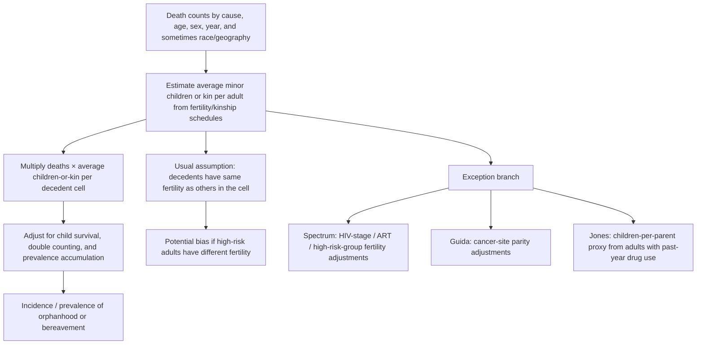
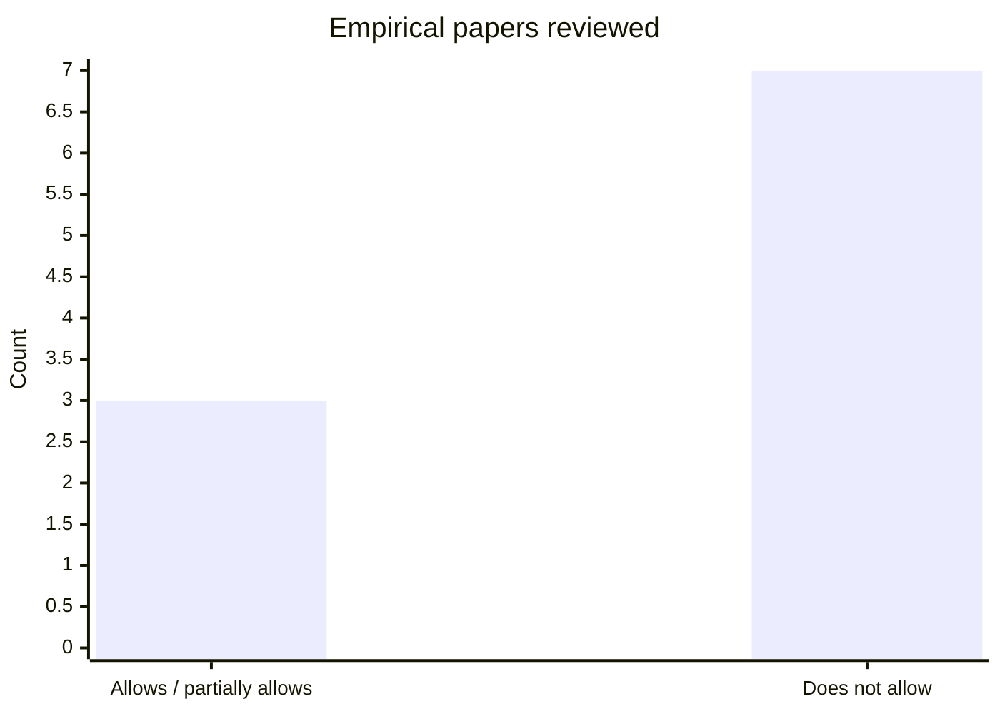

# Fertility Assumptions in Orphanhood and Bereavement Estimation Papers

## Executive summary

The main answer is that the orphanhood and bereavement estimation literature **mostly does not observe actual children per decedent and mostly does not allow fertility to differ within demographic cells by mortality or cause-of-death risk**. Instead, the dominant strategy is to combine death counts with **average fertility or kinship schedules** defined by broad strata such as age, sex, race/ethnicity, year, and sometimes geography. In other words, most papers estimate children exposed to bereavement by multiplying deaths in a cell by an estimated average number of minor children or relatives for adults in that cell, rather than by linking each decedent to their actual children. This is explicit in the major US demographic-modeling papers in your uploaded set and in related COVID orphanhood papers. citeturn10view3turn9view2turn13view1turn16view0turn17view1 fileciteturn0file1 fileciteturn0file2 fileciteturn0file4

There are a few important exceptions. The clearest are the long-running HIV/AIDS orphanhood models implemented in the entity["organization","UNAIDS","Geneva, Switzerland"]/Spectrum framework, which explicitly adjust fertility for HIV infection, ART status, and—outside sub-Saharan Africa—lower-fertility high-risk groups. Another important exception is Guida et al. on maternal cancer orphanhood, which adjusts the expected number of children for cancer sites whose risks are parity-related, increasing expected children for cervical cancer deaths and reducing them for ovarian cancer deaths. A more limited intermediate case is Jones et al. on overdose, which uses the mean number of co-resident children among adults with **past-year drug use** in the same sex-age-race/ethnicity group, rather than the general-population fertility schedule. citeturn7view1turn7view3turn5search6turn4view0turn13view1turn13view2

So the literature is **not uniformly “no heterogeneity”**, but the high-level pattern is clear: **most published orphanhood/bereavement estimation papers assume that, within the demographic cells they use, people who die have the same fertility/kinship structure as people who do not die**. Sensitivity analyses sometimes test this assumption, but direct observation of cause-specific children-per-decedent is rare in the national and global estimation papers. Among the empirical papers reviewed below, I would classify roughly **3 of 10** as allowing meaningful mortality-risk-linked fertility heterogeneity in the core method or via explicit cause/risk adjustments, and **7 of 10** as not doing so. citeturn9view2turn9view3turn13view1turn16view0turn17view1turn4view0turn7view1turn7view3 fileciteturn0file1 fileciteturn0file2 fileciteturn0file4

## Papers reviewed

I prioritized the uploaded papers and closely related primary papers that are central to the methodological question.

**Uploaded papers**

- Villaveces A, Wang D, Massetti G, et al. *Orphanhood and caregiver death among children in the United States by all-cause mortality, 2000–2021.* **Nature Medicine**. 2025;31:672–683. doi:10.1038/s41591-024-03343-6. urlOfficial articleturn0search0 citeturn0search0turn8view0turn10view3turn9view2 fileciteturn0file0  
- Schlüter BS, Alburez-Gutierrez D, Bibbins-Domingo K, Alexander MJ, Kiang MV. *Youth Experiencing Parental Death Due to Drug Poisoning and Firearm Violence in the US, 1999–2020.* **JAMA**. 2024;331(20):1741–1747. doi:10.1001/jama.2024.8391. urlOfficial article recordturn0search1 citeturn0search1turn0search5 fileciteturn0file4  
- Potter AL, Schlüter BS, Alexander MJ, Yang CFJ, Kiang MV. *Youths Experiencing Parental Death Due to Cancer.* **JAMA Network Open**. 2025;8(7):e2519106. doi:10.1001/jamanetworkopen.2025.19106. urlOfficial articleturn0search2 citeturn0search2turn0search10 fileciteturn0file3  
- Verdery AM, Ryan-Claytor C, Smith-Greenaway E, Sarkar N, Livings M. *More Than 1.4 Million US Children Have Lost a Family Member to Drug Overdose.* **American Journal of Public Health**. 2024;114(12):1394–1397. doi:10.2105/AJPH.2024.307847. urlDOI linkhttps://doi.org/10.2105/AJPH.2024.307847 citeturn0search3turn0search7 fileciteturn0file1  
- Alburez-Gutierrez D, Acosta E, Zagheni E, Williams NE. *The long-lasting effect of armed conflicts deaths on the living: quantifying family bereavement.* **Science Advances**. 2024;10(30):eado6951. doi:10.1126/sciadv.ado6951. urlOfficial articleturn1search0 citeturn1search0turn1search8 fileciteturn0file2  
- Smith-Greenaway E, Verdery AM, Carr D. *The New Sociology of Bereavement.* **Annual Review of Sociology**. 2025;51:357–375. doi:10.1146/annurev-soc-090324-035534. urlDOI linkhttps://doi.org/10.1146/annurev-soc-090324-035534 fileciteturn0file5  

**Other relevant primary papers**

- Jones CM, Zhang K, Han B, et al. *Estimated Number of Children Who Lost a Parent to Drug Overdose in the US From 2011 to 2021.* **JAMA Psychiatry**. 2024;81(8):789–796. doi:10.1001/jamapsychiatry.2024.0810. urlOfficial articleturn11search0 citeturn12view0turn13view1turn13view2  
- Hillis SD, Blenkinsop A, Villaveces A, et al. *COVID-19–Associated Orphanhood and Caregiver Death in the United States.* **Pediatrics**. 2021;148(6):e2021053760. doi:10.1542/peds.2021-053760. urlOfficial articleturn14search1 citeturn16view0  
- Hillis S, N’konzi J-PN, Msemburi W, et al. *Orphanhood and Caregiver Loss Among Children Based on New Global Excess COVID-19 Death Estimates.* **JAMA Pediatrics**. 2022;176(11):1145–1148. doi:10.1001/jamapediatrics.2022.3157. urlOfficial articleturn14search13 citeturn15view0turn17view1  
- Guida F, Kidman R, Ferlay J, et al. *Global and regional estimates of orphans attributed to maternal cancer mortality in 2020.* **Nature Medicine**. 2022;28:2563–2572. doi:10.1038/s41591-022-02109-2. urlOfficial articleturn2search0 citeturn2search0turn4view0  
- Stover J, Brown T, Puckett R, et al., plus the AIDS Impact Model manual in Spectrum. These are the key primary/official sources for the HIV orphanhood exception. urlSpectrum manualturn5search0 urlSpectrum methods paperturn5search6 citeturn5search0turn7view1turn7view3turn5search6turn5search10  

## Cross-paper comparison

The table below focuses on the specific question you asked: whether fertility is allowed to vary with mortality risk, at what level, and whether actual children per decedent are observed.

| Paper | Core inputs | Fertility varies by age | sex/gender | race/ethnicity | calendar year | geography | SES | cause of death | within-cell mortality risk | Linked individual-level birth–death/family data observing children per decedent? | Bottom line |
|---|---|---:|---:|---:|---:|---:|---:|---:|---:|---:|---|
| Villaveces 2025 | NCHS death records + natality + child survival + ACS grandparent data | Y | Y | Y | Y | Y (state) | Unknown | **No** | **No in core model**; sensitivity only | No | Standard demographic-rate model; same fertility within age-sex-race-year-state strata for decedents and nondecedents |
| Schlüter 2024 | Mortality + female fertility + modeled male fertility + Census | Y | Y | Y | Y | No national only | Unknown | **No** | **No** | No | Explicitly assumes equal fertility for those who die by drugs/firearms and those who do not |
| Potter 2025 | Mortality + female fertility + Human Fertility Collection male fertility + Census | Y | Y | Y | Y | No national only | Unknown | **No** | **No** | No | Same structure as Schlüter; explicit equal-fertility limitation |
| Verdery 2024 AJPH | Dynamic kinship model + overdose mortality 2000–2019 | Y | Y (male/female relatives modeled separately) | Unknown/not reported | Y | No national only | Unknown | No | No | No | Bereavement prevalence model using broad demographic rates, not observed decedent children |
| Alburez-Gutierrez 2024 Sci Adv | Conflict deaths + UN kinship model inputs + female fertility only | Y | Partial (male fertility approximated from female) | No | Y | Yes (country) | No | No | No | No | Bereavement model, not orphanhood-specific; no within-population heterogeneity in kinship structures |
| Jones 2024 | NVSS overdose deaths + NSDUH mean co-resident children among adults with past-year drug use | Y | Y | Y | Partial (2 pooled periods applied over years) | No national only | Unknown | Indirectly, via overdose-specific sample | **Partial** | No | Important intermediate case: children-per-decedent proxy comes from a higher-risk group, not the general population |
| Hillis/Villaveces 2021 US COVID | Excess/COVID deaths + fertility + ACS household composition | Y | Y | Y | Y | Y (state) | Unknown | No | No | No | COVID-specific mortality but fertility not cause- or risk-specific within cells |
| Hillis/Unwin 2022 global COVID | Excess deaths + age-specific deaths/fertility, extrapolated with TFR-based logistic models | Partial | Partial | No | Y | Y (country) | No | No | No | No | Global extrapolation driven mainly by mortality and national fertility, not direct children-per-decedent |
| Guida 2022 | Female cancer deaths + cohort fertility + child survival | Y | No maternal only | No | Y (cohort years) | Y (country) | No | **Yes, for some sites** | **Partial** | No | Exception: parity-risk adjustments by cancer site |
| Spectrum / AIDS orphanhood | HIV incidence/prevalence, AIDS vs non-AIDS mortality, HIV-stage/ART fertility, risk groups | Y | Y | Depends on country file, not core published rule | Y | Y (country/epidemic type) | No | **Yes** | **Yes** | No | Strongest exception in the literature |

This comparison supports a simple synthesis: the **default estimating architecture is broad-cell demographic averaging**, not direct measurement of cause-specific fertility among those actually at high mortality risk. The most important exceptions are **HIV/Spectrum**, **Guida et al.**, and the more limited **Jones et al.** overdose approach. citeturn9view2turn13view1turn16view0turn17view1turn4view0turn7view1turn7view3 fileciteturn0file1 fileciteturn0file2 fileciteturn0file4

## What each paper is actually assuming

The Villaveces all-cause orphanhood paper is unusually transparent. It calculates fertility rates by year, age, sex, and standardized race/ethnicity, and then states that it assumes population-level fertility rates are **not correlated** with population-level mortality rates, while also testing scenarios that dampen fertility near death. In sensitivity analyses, these dampening scenarios lowered orphanhood incidence by as much as 8.4% and prevalence by as much as 15%, which is direct evidence that the assumption matters. citeturn10view3turn9view2turn9view3

The Schlüter drugs/firearms paper makes the same assumption even more directly: after adjusting for year, age, sex, and race/ethnicity, people dying by drugs or firearms are assumed to have the same fertility as those who do not. It then varies the fertility rate of those dying by drugs/firearms by ±25% in sensitivity analysis and reports that the substantive conclusions are robust, but the central model still imposes equal fertility within cells. Potter’s cancer paper explicitly repeats the same limitation for cancer deaths. fileciteturn0file4 fileciteturn0file3

The Jones overdose paper is methodologically different and important for your question. It does **not** use general-population fertility schedules. Instead, it estimates the mean number of co-resident children among adults with **past-year drug use** in the same sex-age-race/ethnicity group from NSDUH and applies that to overdose decedents in NVSS. That means it partially relaxes the usual assumption by letting “children per adult” differ for a risk-proximate group, but it still does not observe the actual children of the overdose decedents, and it assumes overdose decedents have the same co-resident-child distribution as adults with past-year drug use in the same broad demographic cell. citeturn13view1turn13view2turn12view0

The COVID orphanhood papers are also mostly in the standard mold. The US Pediatrics paper uses excess/COVID mortality plus fertility and ACS household composition, stratified by state, sex, and race/ethnicity, but it does not allow fertility to vary by individual mortality risk within those strata. The global COVID update uses prior methodology “combining age-specific death and fertility rates,” then extrapolates across countries using TFR-linked logistic models; this is even more aggregate and farther from directly observing children per decedent. citeturn16view0turn15view0turn17view1turn19search0

The AJPH overdose-family paper and the Science Advances conflict-bereavement paper fit the same broad pattern. The AJPH paper uses demographic kinship modeling with dynamic fertility and mortality schedules to estimate children’s exposure to overdose deaths among parents, siblings, grandparents, aunts/uncles, and cousins. The Science Advances paper uses demographic kinship models with year-sex-age survival probabilities and female fertility from the UN population system, plus an androgynous approximation for male fertility, and explicitly states that its models do not account for within-population variability in kinship structures. fileciteturn0file1 fileciteturn0file2

## Exceptions that materially depart from the usual assumption

The most important exception is the HIV orphanhood literature built into Spectrum. Spectrum’s AIDS Impact Model estimates maternal, paternal, and double AIDS orphans by parent’s cause of death and includes two kinds of fertility adjustment relevant to your question. First, it models reduced fertility among women infected with HIV who are not on ART. Second, for concentrated epidemics outside sub-Saharan Africa, it explicitly adjusts orphan estimates for the lower fertility of high-risk groups such as men who have sex with men, people who inject drugs, and sex workers. That is exactly the kind of mortality-risk-linked fertility heterogeneity that most other orphanhood papers do not model. citeturn7view1turn7view3turn5search6turn5search10

The other high-value exception is Guida et al. on maternal cancer orphanhood. Their core equation multiplies female cancer deaths by the average number of living children under 18 for the relevant birth cohort, but then **adjusts that average to the specific cancer death in question**. They raise expected children by 10% for cervical cancer deaths and reduce them by 20% for ovarian cancer deaths, reflecting parity-risk relationships, and they also make an age-restricted adjustment for breast cancer because parity is more clearly protective only at postmenopausal ages. This is not full individual-level modeling, but it is a real cause-specific fertility correction and therefore a genuine exception. citeturn4view0

A third, weaker exception is Jones et al., because it uses a risk-proximate group rather than the general population. But compared with Spectrum and Guida, it is still relatively coarse: it is based on co-resident children among survey respondents with past-year drug use, not on actual overdose decedents or finer gradients of overdose risk. citeturn13view1turn13view2

## Common assumptions, sensitivity analyses, and likely bias directions

Across the literature, five assumptions recur.

First, most papers use **broad demographic cells** as the unit at which fertility varies: age, sex, sometimes race/ethnicity, year, and sometimes geography. Within those cells, fertility is assumed constant for decedents and nondecedents. citeturn10view3turn9view2turn16view0turn17view1

Second, most papers do **not** use linked administrative family data to observe actual children per decedent. The orphanhood/bereavement totals are model-implied, not record-linked. Even Jones, the strongest US overdose exception, uses survey-derived means rather than linked children of decedents. citeturn13view1turn13view2turn16view0turn17view1turn4view0turn7view3

Third, male fertility is often a weak point. Villaveces derives male fertility from vital statistics; Schlüter and Potter note limited male fertility data; the conflict paper uses the androgynous approximation because male fertility data are unavailable. citeturn10view3 fileciteturn0file3 fileciteturn0file4 fileciteturn0file2

Fourth, race/ethnicity is modeled in several US papers, but mostly by **assuming the child’s race/ethnicity matches the parent’s**. That is useful for disparity description but not a solution to within-cell fertility–mortality selection. citeturn10view4turn16view0

Fifth, sensitivity analyses usually probe the concern you raised, but only indirectly. Villaveces dampens fertility close to death; Schlüter varies fertility of decedents by ±25%; Guida varies prevalence inputs and child-survival assumptions; the conflict paper shows mortality clustering could reduce estimated bereavement rates in a high-clustering setting. These exercises are informative, but they do not replace direct estimation of children-per-decedent by cause. citeturn9view3turn4view0 fileciteturn0file2 fileciteturn0file4

The likely bias direction depends on the cause of death.

If adults at high mortality risk have **lower fertility** than others in the same demographic cell—for example because of severe illness, heavy substance use, incarceration, homelessness, combatant selection, or union instability—then standard demographic-rate models will **overestimate** orphanhood/bereavement because they assign too many children to decedents. This is the concern Villaveces makes explicit. citeturn9view2turn9view3

If high-risk adults have **higher fertility** than their demographic peers—for example because of socioeconomic disadvantage, lower contraceptive access, earlier childbearing, or cause-specific parity associations—then the same models can **underestimate** bereavement. Villaveces notes this as a real possibility, and Guida’s cervical-cancer adjustment is a concrete example where ignoring parity would bias downward. citeturn9view3turn4view0

Cause matters. HIV/AIDS is the clearest case where using general-population fertility would often overstate maternal AIDS orphanhood, which is why Spectrum adjusts fertility downward for HIV infection and high-risk groups. Cervical cancer likely does the opposite. Overdose is ambiguous: a general-population fertility schedule could overstate children-per-decedent if overdose decedents are less likely to be stably co-resident parents, but it could understate burden if decedents are concentrated in higher-parity disadvantaged groups. Jones’ design is valuable precisely because it partially moves toward measuring that difference. citeturn7view1turn7view3turn13view1turn13view2turn4view0

## Datasets and study designs that would directly answer the question

The strongest next step would be to estimate **cause-specific children-per-decedent directly**, not infer it from general fertility schedules.

For the United States, the best design would be a **restricted, person-linked administrative linkage** that starts from death certificates and links decedents to their children using birth certificates, household rosters, tax/benefit records, or state integrated data systems. The key output should be the mean and distribution of living children under 18 per decedent by cause of death, age, sex, race/ethnicity, geography, and SES. At minimum, this could be done in a set of states with high-quality vital-record linkage. A second-best national design would combine NVSS deaths with survey or administrative sources that directly identify dependent children rather than relying on broad fertility schedules. The Jones paper shows the proof of concept for cause-adjacent proxying, but a real advance would be direct linkage to children rather than co-resident-child means from NSDUH. citeturn13view1turn13view2

Internationally, the gold standard would be countries with **population registers and parent-child linkage**, especially where cause-of-death data are reliable. Those settings could estimate actual children-per-decedent by cause and then show how large the bias is in broad-cell demographic models. For lower- and middle-income settings, a strong option is linkage in longitudinal demographic surveillance systems with parent identifiers and verbal-autopsy or cause-of-death modules. More modestly, studies can emulate Guida’s approach and introduce **cause-specific fertility corrections** based on known epidemiology when direct linkage is impossible. citeturn4view0turn7view1turn7view3

The ideal study design has three layers. First, estimate actual children-per-decedent by cause from linked microdata. Second, compare those estimates with the children-per-decedent implied by the demographic-rate model used in the published paper. Third, build correction factors or predictive models that can be exported to places without linked data. This would let the field move from “assume equal fertility within cells” to “calibrate equal-cell models using observed selection.” citeturn9view3turn13view1turn4view0turn7view3

## Suggested figures

The logic used in most papers can be summarized as follows. This is the dominant architecture in Villaveces, Schlüter, Potter, the COVID papers, Verdery’s overdose-family paper, and the conflict-bereavement paper; the deviations are the explicit exception branches for Spectrum, Guida, and, more modestly, Jones. citeturn10view3turn13view1turn16view0turn17view1turn4view0turn7view3 fileciteturn0file1 fileciteturn0file2 fileciteturn0file4

If you want a simple figure for the empirical papers in this report, the count is approximately **3 that allow or partially allow within-cell fertility heterogeneity** versus **7 that do not**, excluding the Annual Review because it is not an estimation model. I am grouping Jones, Guida, and Spectrum on the “allow/partial allow” side. citeturn13view1turn4view0turn7view1turn7view3turn9view2turn16view0turn17view1 fileciteturn0file1 fileciteturn0file2 fileciteturn0file4

## Open questions and limitations

I am confident about the main conclusion, but three limits are worth stating clearly.

First, for some uploaded papers—especially the AJPH overdose-family paper and the conflict-bereavement paper—the central methodological conclusion is high-confidence, but some fine-grained covariate handling is **not fully reported in the abstract-level web sources** and therefore should be treated as “unknown unless explicitly stated.” That is why several cells in the comparison table are marked unknown rather than inferred. citeturn0search7turn1search0 fileciteturn0file1 fileciteturn0file2

Second, I did **not** identify a major national/global orphanhood estimation paper that uses linked birth–death/family administrative data to observe actual children per decedent directly. That absence is itself a substantive finding, but there may be local or non-English studies outside the core literature reviewed here. citeturn12view0turn16view0turn17view1turn4view0turn7view3

Third, the “allow/does not allow within-cell heterogeneity” count necessarily compresses a spectrum. Jones is not equivalent to Spectrum; Guida’s site-specific parity corrections are narrower than HIV-stage fertility modeling. The important point is not the exact count, but the structural pattern: **most papers still rely on broad-cell average fertility, with only a few papers building in mortality-risk-linked fertility differences in a serious way.** citeturn13view1turn4view0turn7view1turn7view3turn9view2