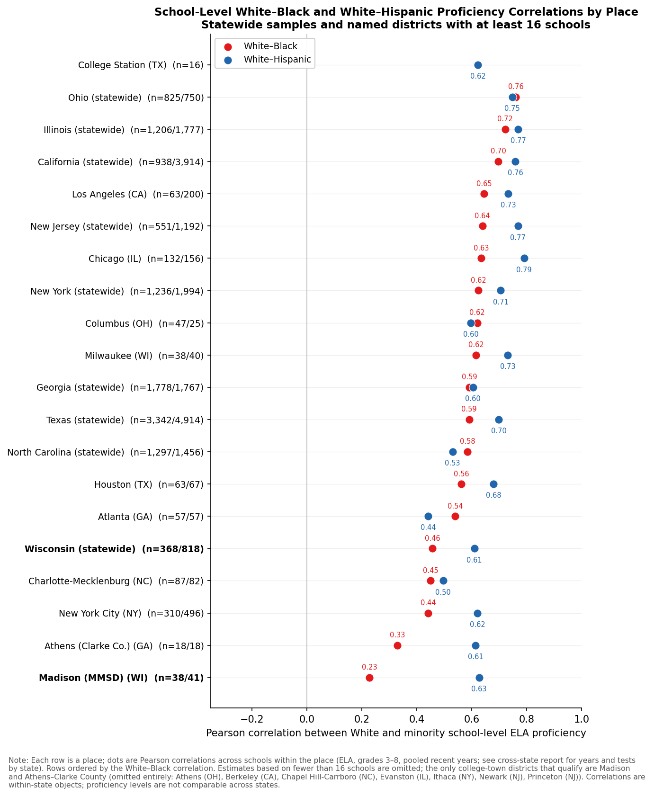
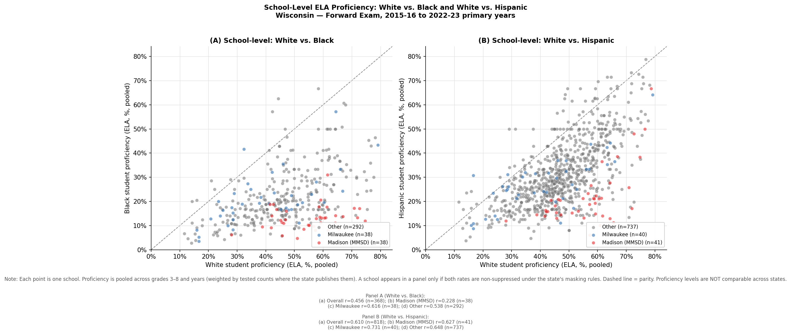
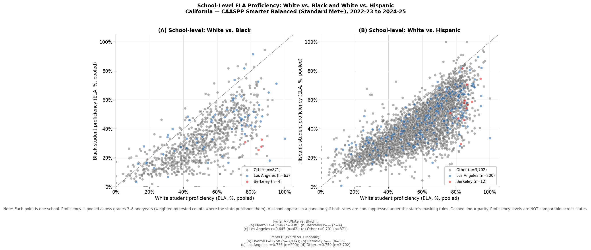
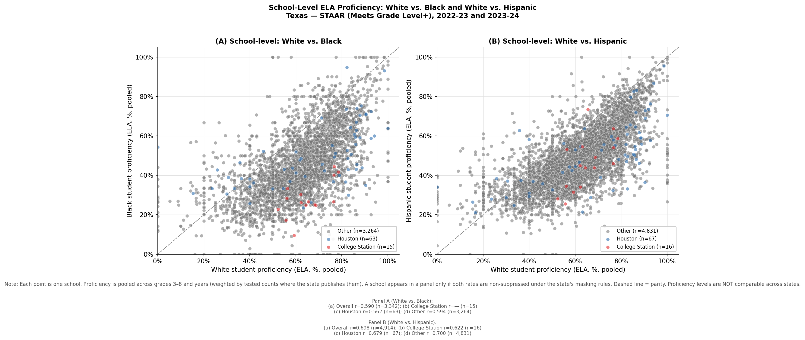
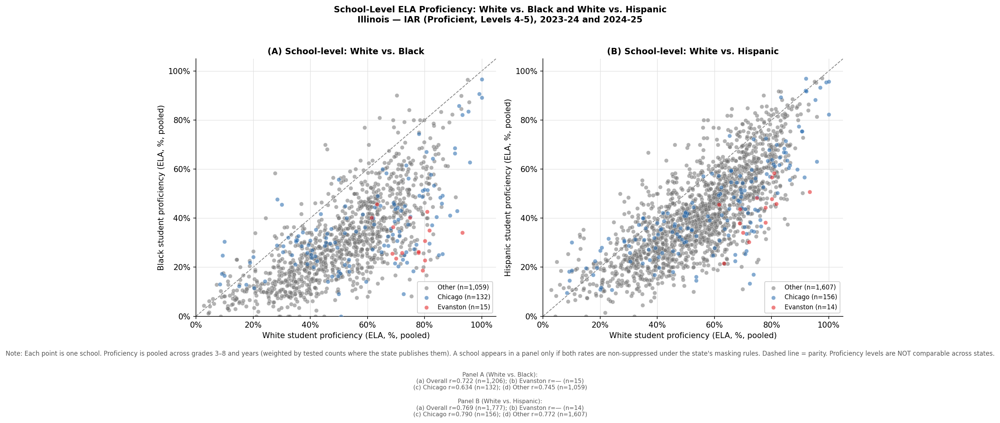
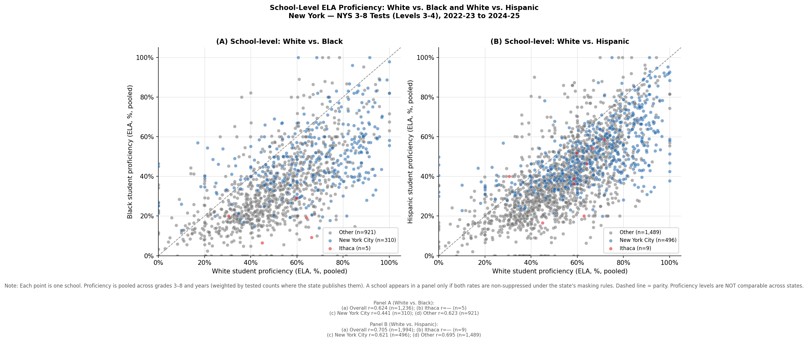
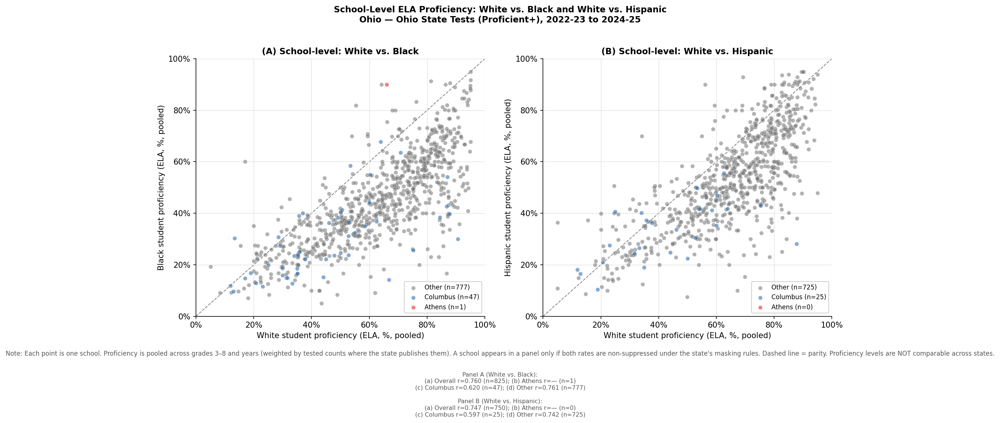
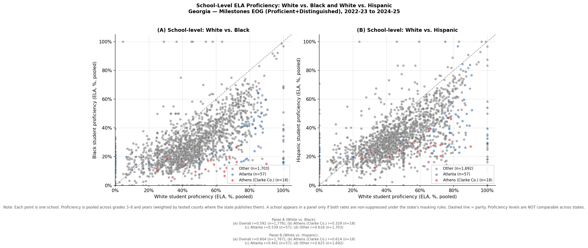
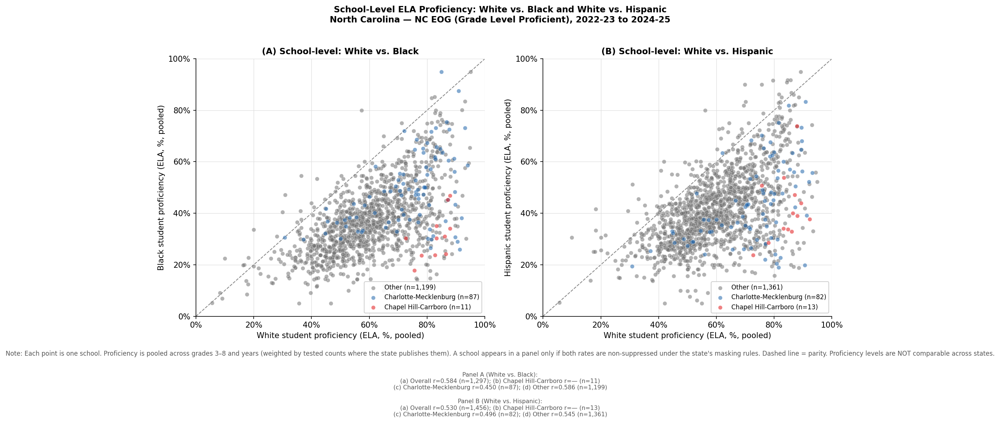
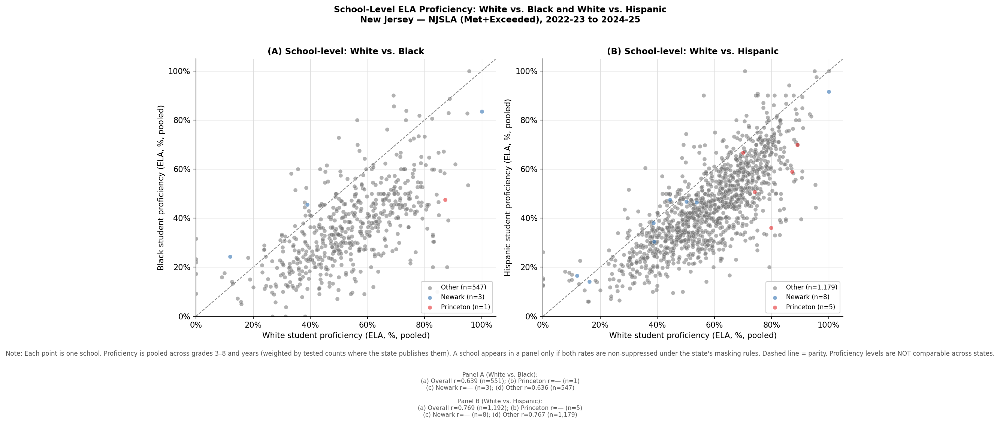

```{=latex}
\clearpage
```

# Introduction

The Wisconsin report documents that within MMSD, the school-level association
between White and Black proficiency is remarkably weak: schools where White
students post very high ELA proficiency are barely more likely to have high
Black proficiency (Pearson $r \approx 0.23$ across 38 MMSD schools with both
rates published). Statewide, that correlation is 0.46, and in Milwaukee it is
0.62. For Hispanic students the association is strong everywhere in Wisconsin,
including MMSD ($r \approx 0.63$).

Two interpretations compete. One reads the weak MMSD correlation as a
Madison-specific failure: whatever school-level resources and conditions lift
White achievement in MMSD do not reach Black students. The other notes that
MMSD is a high-SES college-town district — White proficiency is uniformly high
and compressed across its schools, so there is little variation on the
horizontal axis for Black proficiency to co-move with, and the Black student
population may be more residentially and economically distinct from the White
population than in a typical district.

Distinguishing these stories requires comparison districts. The Stanford
Education Data Archive publishes school-level averages only for all students
combined (race breakdowns exist only at the district level), so it cannot
speak to within-district school-level racial correlations. We therefore went
to state education department report-card downloads directly. Eight states
publish school-level proficiency by race/ethnicity in downloadable form with
usable recent coverage: **California, Texas, Illinois, New York, Ohio,
Georgia, North Carolina, and New Jersey**. Together with Wisconsin, the
analysis covers nine states, including four of the five largest U.S. school
systems (New York City, Los Angeles, Chicago, Houston).

For each state we replicate the Wisconsin Figure 12 design: each point is a
school; Panel A plots White (x-axis) against Black (y-axis) ELA proficiency,
Panel B against Hispanic proficiency; points are colored to flag the state's
largest urban district (the Milwaukee analog) and a designated college-town
district (the MMSD analog); the figure notes report Pearson correlations for
the overall sample and each subgroup.

**A critical caveat throughout: proficiency levels are not comparable across
states.** Each state administers its own test with its own cut scores — Texas
"Meets Grade Level or Above" and NC "Grade Level Proficient" are not the same
standard as Wisconsin's Forward Exam proficiency. All cross-state comparisons
in this report concern the *within-state shape* of the school scatter — the
correlations — never the levels.

# Data

Each state's data come from its education department's public report-card or
assessment download site, harmonized to a common school-by-race panel
(`analysis/13_download_states.py`, `analysis/14_load_states.py`). ELA is the
primary subject, grades 3–8 (elementary/middle), pooled over the 2–3 most
recent available years. Masked cells are treated as missing, never imputed.
Where a state publishes tested counts, pooling is count-weighted; where it
publishes only percentages (Illinois, Ohio), pooling is an unweighted mean
over grade-year cells.

| State | Test (proficiency standard) | Years | School-level N by race? | Masking rule |
|----|--------------|------|------|---------------|
| WI | Forward Exam (Proficient+) | 2015-16 to 2022-23 | Yes | n < 10 suppressed |
| CA | CAASPP Smarter Balanced (Standard Met+) | 2022-23 to 2024-25 | Yes | n < 11 suppressed |
| TX | STAAR (Meets Grade Level+) | 2022-23, 2023-24 | Yes | small cells masked |
| IL | IAR (Levels 4–5) | 2023-24, 2024-25 | No | small cells starred |
| NY | NYS 3–8 Tests (Levels 3–4) | 2022-23 to 2024-25 | Yes | small cells suppressed |
| OH | Ohio State Tests (Proficient+) | 2022-23 to 2024-25 | No | "NC" for small cells |
| GA | Milestones EOG (Proficient + Distinguished) | 2022-23 to 2024-25 | Yes | too-few-students masked |
| NC | NC EOG (Grade Level Proficient) | 2022-23 to 2024-25 | Yes | bounded (<5, >95) |
| NJ | NJSLA (Met + Exceeded) | 2022-23 to 2024-25 | Yes | starred cells |

: Data sources by state. "Years" are pooled within state. See `DATA.md` for URLs and per-state notes. {#tbl-sources}

Four additional states were attempted and set aside: Florida blocks scripted
downloads at the network level; Michigan's MI School Data requires an
interactive Power BI export; Minnesota's data center timed out on repeated
attempts; and Massachusetts's DESE state reports require a session-based form
export. These are documented in `DATA.md` for manual follow-up.

The designated **largest-urban analogs** (Milwaukee's role in the Wisconsin
figure) are Los Angeles, Houston, Chicago, New York City, Columbus, Atlanta,
Charlotte-Mecklenburg, and Newark. The designated **college-town analogs**
(MMSD's role) are Berkeley, College Station, Evanston (CCSD 65), Ithaca,
Athens (OH), Athens–Clarke County (GA), Chapel Hill-Carrboro, and Princeton.

**Reporting threshold.** A correlation computed over a handful of schools is
dominated by noise (the standard error of $r$ near zero is roughly
$1/\sqrt{n-3}$, about 0.28 with 15 schools). Throughout this report we
therefore report correlations only for places with **at least 16 schools**
contributing both rates; smaller subsamples are shown as "—" with their school
count. This screen removes nearly every college-town analog (and Newark, where
heavy small-cell suppression leaves few White rates published): college towns
are inherently small districts, and most have too few schools with published
Black proficiency rates to support any correlation at all. That sparsity is
itself informative about how unusual MMSD's combination of size and
college-town character is — Madison, at 38 schools with published Black rates,
has no true peer in these eight states.

# Results

## Summary: where Wisconsin and MMSD sit

@tbl-corr-black and @tbl-corr-hisp collect the Pearson correlations from all
nine state figures (cell entries are $r$ with the number of schools in
parentheses; "—" indicates fewer than 16 schools with both rates published,
below the reporting threshold).

| State | Overall | College-town district | Largest urban district | Other |
|----|------|--------------|--------------|------|
| Wisconsin | 0.46 (368) | **0.23 (38)** Madison | 0.62 (38) Milwaukee | 0.54 (292) |
| California | 0.70 (938) | — (4) Berkeley | 0.65 (63) Los Angeles | 0.70 (871) |
| Texas | 0.59 (3,342) | — (15) College Station | 0.56 (63) Houston | 0.59 (3,264) |
| Illinois | 0.72 (1,206) | — (15) Evanston | 0.63 (132) Chicago | 0.75 (1,059) |
| New York | 0.62 (1,236) | — (5) Ithaca | 0.44 (310) New York City | 0.62 (921) |
| Ohio | 0.76 (825) | — (1) Athens | 0.62 (47) Columbus | 0.76 (777) |
| Georgia | 0.59 (1,778) | 0.33 (18) Athens–Clarke | 0.54 (57) Atlanta | 0.62 (1,703) |
| North Carolina | 0.58 (1,297) | — (11) Chapel Hill-Carrboro | 0.45 (87) Charlotte-Mecklenburg | 0.59 (1,199) |
| New Jersey | 0.64 (551) | — (1) Princeton | — (3) Newark | 0.64 (547) |

: School-level Pearson correlations, White vs. **Black** ELA proficiency. {#tbl-corr-black}

| State | Overall | College-town district | Largest urban district | Other |
|----|------|--------------|--------------|------|
| Wisconsin | 0.61 (818) | 0.63 (41) Madison | 0.73 (40) Milwaukee | 0.65 (737) |
| California | 0.76 (3,914) | — (12) Berkeley | 0.73 (200) Los Angeles | 0.76 (3,702) |
| Texas | 0.70 (4,914) | 0.62 (16) College Station | 0.68 (67) Houston | 0.70 (4,831) |
| Illinois | 0.77 (1,777) | — (14) Evanston | 0.79 (156) Chicago | 0.77 (1,607) |
| New York | 0.71 (1,994) | — (9) Ithaca | 0.62 (496) New York City | 0.70 (1,489) |
| Ohio | 0.75 (750) | — (0) Athens | 0.60 (25) Columbus | 0.74 (725) |
| Georgia | 0.60 (1,767) | 0.61 (18) Athens–Clarke | 0.44 (57) Atlanta | 0.62 (1,692) |
| North Carolina | 0.53 (1,456) | — (13) Chapel Hill-Carrboro | 0.50 (82) Charlotte-Mecklenburg | 0.55 (1,361) |
| New Jersey | 0.77 (1,192) | — (5) Princeton | — (8) Newark | 0.77 (1,179) |

: School-level Pearson correlations, White vs. **Hispanic** ELA proficiency. {#tbl-corr-hisp}

Four findings stand out.

1. **The statewide White–Black school-level correlation is strong everywhere.**
   Every state's overall correlation falls between 0.58 (North Carolina) and
   0.76 (Ohio) — Wisconsin's 0.46 is actually the *lowest* of the nine states,
   pulled down in part by MMSD itself. Schools that produce high White
   proficiency generally also produce higher Black proficiency, across very
   different state contexts.

2. **MMSD's near-zero correlation is not replicated in any state's overall
   sample, and almost no college-town analog is large enough to test.** Every
   designated analog except Athens–Clarke County falls below the 16-school
   reporting threshold — MMSD, at 38 schools with published Black rates, is by
   far the largest district of this type in any of the nine states.
   Athens–Clarke (0.33, 18 schools) does show a markedly weaker White–Black
   correlation than its statewide sample (0.59), directionally consistent with
   a college-town pattern, but one district is thin evidence. The honest
   summary is that MMSD's weak correlation is unmatched in any reportable
   sample, and the districts most similar to it are too small to say whether
   they share the pattern.

3. **Largest-urban districts always show solid positive correlations.** From
   New York City (0.44) to Los Angeles (0.65), the Milwaukee-style pattern —
   Black proficiency tracking White proficiency across schools — holds in
   every large urban district with sufficient data. The MMSD pattern is not an
   urban-district phenomenon.

4. **The White–Hispanic correlation is strong and universal.** In all nine
   states, and in every reportable subsample — including MMSD (0.63),
   Athens–Clarke (0.61), and College Station (0.62) — Hispanic proficiency
   co-moves with White proficiency at the school level, with correlations of
   roughly 0.6–0.8 throughout. Whatever decouples Black achievement from
   school-level conditions in MMSD does not decouple Hispanic achievement.
   This asymmetry, first documented for Wisconsin, appears to be a general
   feature.

## Correlations at a glance

@fig-dotplot arrays the White–Black (red) and White–Hispanic (blue)
correlations for every place — statewide samples and named districts — that
clears the 16-school reporting threshold, ordered by the White–Black
correlation. The only college-town analogs that qualify are Madison and
Athens–Clarke County (College Station qualifies for the White–Hispanic panel
only), and the figure's message is stark: MMSD's White–Black correlation of
0.23 sits at the bottom, with Athens–Clarke next at 0.33 and every other place
at 0.44 (New York City) or above — while MMSD's White–Hispanic correlation
(0.63) is unremarkable and sits in the middle of the pack.

{#fig-dotplot width=95%}

## Interpretation for the MMSD boundary discussion

The cross-state evidence sharpens rather than dilutes the Madison finding. In
every reportable sample — nine statewide samples and seven large urban
districts — Black proficiency co-moves substantially with White proficiency
across schools; MMSD's 0.23 has no counterpart. Whether this reflects
something specific to Madison or something generic to high-SES college-town
districts cannot be settled here: the districts most similar to MMSD
(Berkeley, Evanston, Ithaca, Chapel Hill-Carrboro) are simply too small to
estimate the correlation reliably, and the one analog that clears the
threshold, Athens–Clarke County, is only directionally suggestive. What can be
said is that within MMSD, a school's overall success (as proxied by its White
proficiency) provides little information about how its Black students fare.
For the boundary review, the implication parallels the main report's
within-school finding: reassigning students toward "higher-performing" schools
— where performance is certified by overall or White proficiency — has a weak
empirical basis for improving Black student outcomes in MMSD, because the
school-level association those reassignment theories rely on is largely
absent for Black students there.

## State-by-state figures

Wisconsin appears first for reference; the remaining states follow in the
order of @tbl-sources. Axes are percentage proficient on each state's own
standard; the dashed line is parity.

{#fig-wi width=100%}

{#fig-ca width=100%}

{#fig-tx width=100%}

{#fig-il width=100%}

{#fig-ny width=100%}

{#fig-oh width=100%}

{#fig-ga width=100%}

{#fig-nc width=100%}

{#fig-nj width=100%}

# Limitations

- **Different tests and cut scores.** Levels are not comparable across states;
  only within-state correlations and scatter shapes are compared. Even
  correlations can be affected by where a state's cut score falls in the
  achievement distribution (a cut in the tail compresses variation and
  attenuates correlations).
- **Masking regimes differ.** Wisconsin suppresses cells under 10 students;
  California under 11; Ohio and Illinois suppress small cells without
  publishing counts; North Carolina bounds extreme percentages instead of
  suppressing. States with stricter masking systematically drop
  smaller-minority-population schools, which tends to *raise* observed
  correlations by retaining more diverse schools.
- **Weighting differs where counts are unpublished.** Illinois and Ohio pooled
  rates are unweighted means over grade-year cells rather than count-weighted;
  this adds noise for small schools.
- **Charter treatment differs.** Some states report charters inside their
  authorizing district (NYC geographic districts exclude most charters), others
  as their own districts (Texas, Georgia state charters). The "largest urban"
  subsamples are therefore not perfectly consistent in scope.
- **College-town analogs are small.** Only MMSD (38 schools) and Athens–Clarke
  (18) clear the 16-school reporting threshold in Panel A; every other
  designated analog has 15 or fewer schools with both rates published, so
  their correlations are not reported anywhere in this report. The
  college-town interpretation of the MMSD pattern therefore rests on one
  out-of-state district and remains a hypothesis.
- **Years pooled differ by state** (Table 1), spanning 2015–2023 for Wisconsin
  but 2022–2025 elsewhere. The Wisconsin correlations are essentially unchanged
  when restricted to recent years, so this is unlikely to drive the contrast.

# Reproducibility

All code is in the repository: `analysis/13_download_states.py` (downloads),
`analysis/14_load_states.py` (harmonization to
`output/data/panel_school_race_multistate.parquet`, with a QC report at
`output/tables/multistate_qc.txt`), and
`analysis/15_multistate_school_scatter.py` (figures and
`output/tables/multistate_school_correlations.csv`). State-by-state source
notes, URLs, and quirks are documented in `DATA.md`.
