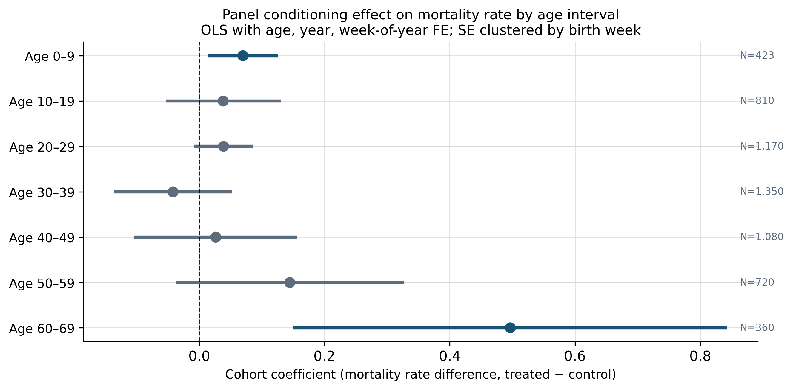
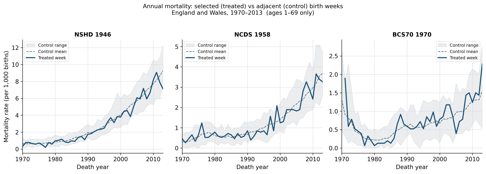
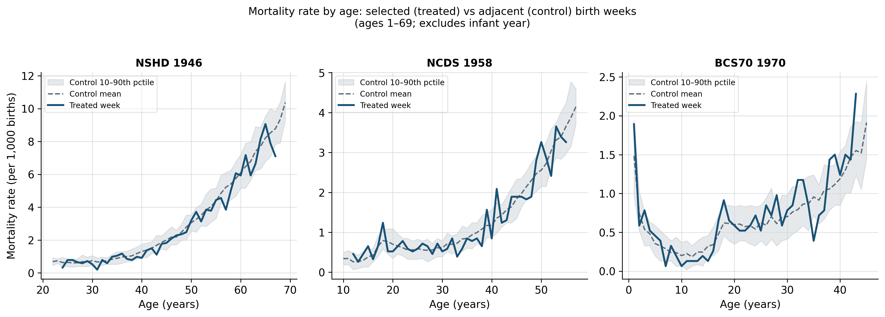
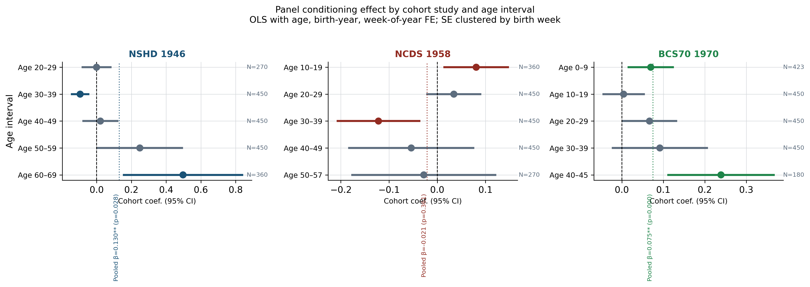
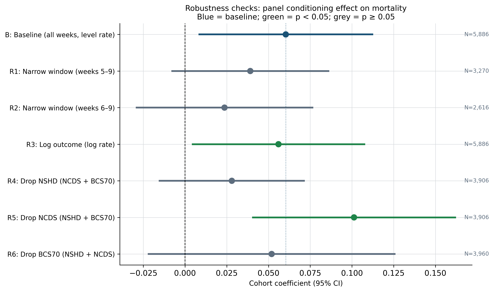

```{python}
#| output: false
import json, pandas as pd, pathlib, numpy as np, warnings, textwrap
warnings.filterwarnings("ignore")

# Load pre-computed results summary
results = json.loads(
    pathlib.Path("../output/tables/04_results_summary.json").read_text()
)
p_coef  = results["pooled"]["coef"]
p_se    = results["pooled"]["se"]
p_pval  = results["pooled"]["pval"]
p_stars = results["pooled"]["stars"]

int_df  = pd.read_csv("../output/tables/04_table2_age_intervals.csv")
bc_df   = pd.read_csv("../output/tables/04_table3_by_cohort.csv")
bc      = results["by_cohort"]
nshd_p  = bc["NSHD 1946"]["Pooled"]
ncds_p  = bc["NCDS 1958"]["Pooled"]
bcs_p   = bc["BCS70 1970"]["Pooled"]

# Robustness table
rob_df  = pd.read_csv("../output/tables/06_robustness_coef.csv")
def stars(p):
    return "***" if p<0.01 else "**" if p<0.05 else "*" if p<0.10 else ""
rob_df["Coef."] = rob_df.apply(
    lambda r: f"{r['coef']:.3f}{stars(r['pval'])}", axis=1)
rob_df["(SE)"]  = rob_df["se"].apply(lambda s: f"({s:.3f})")
rob_df["p"]     = rob_df["pval"].apply(lambda p: f"{p:.3f}")
rob_df["N"]     = rob_df["n"].apply(lambda n: f"{int(n):,}")
rob_display = rob_df[["spec","Coef.","(SE)","p","N"]].rename(
    columns={"spec": "Specification"})

# Cause-of-death table (pooled)
cause_df = pd.read_csv("../output/tables/05_cause_coef_pooled.csv")
cause_df["Coef."] = cause_df.apply(
    lambda r: f"{r['coef']:.3f}{stars(r['pval'])}", axis=1)
cause_df["(SE)"]  = cause_df["se"].apply(lambda s: f"({s:.3f})")
cause_df["p"]     = cause_df["pval"].apply(lambda p: f"{p:.3f}")
cause_display = cause_df[["cause","Coef.","(SE)","p"]].rename(
    columns={"cause":"Cause category"})

# Life expectancy summary
le = json.loads(
    pathlib.Path("../output/tables/07_le_summary.json").read_text()
)

# Permutation test summary
perm = json.loads(
    pathlib.Path("../output/tables/06_permutation_summary.json").read_text()
)
```

# Introduction

Whether participating in a long-term cohort study affects participants' health and longevity
is a substantively important question for the validity of cohort-based research.
If survey participation itself changes behaviour — through health awareness, social contact
with researchers, or other channels — then inferences drawn from cohort data may conflate
panel conditioning effects with the phenomena under study.

The most direct prior evidence comes from @Warren2022_wls_mortality, who exploit the
experimental design of the Wisconsin Longitudinal Study (WLS) to show no effect
of half-century-long cohort participation on longevity. The UK setting offers a complementary
test: three British birth cohort studies (NSHD, NCDS, BCS70) each selected a single week
of births, leaving adjacent weeks as a natural comparison group.

This paper uses administrative vital statistics from England and Wales to ask:
do the mortality profiles of birth weeks selected for major UK cohort studies diverge
from those of similar non-selected weeks as the cohorts age?

# Background

## UK birth cohort studies and the week-of-birth design

The three UK cohort studies examined here each employed an identical sampling strategy:
all births occurring within a single target week were enrolled and followed longitudinally.
The MRC National Survey of Health and Development (NSHD), launched in 1946, enrolled all
children born in England, Scotland, and Wales during 3–9 March 1946 [@Wadsworth2006_nshd_profile].
The National Child Development Study (NCDS) enrolled all births during 3–9 March 1958 in
England, Scotland, and Wales [@Power2005_ncds_profile]. The 1970 British Cohort Study (BCS70)
enrolled births during 5–11 April 1970 in the same geography [@Elliott2006_bcs70_profile].

The week-of-birth design creates a natural comparison group: births in adjacent weeks of
the same year share the same calendar-time exposures (economic conditions, disease environment,
healthcare availability) but were not recruited into the study. This resembles a regression
discontinuity in administrative time, with the selected week as the "treated" unit and
surrounding weeks as controls.

## Panel conditioning and health

Panel conditioning refers to systematic changes in respondents' behaviour, attitudes, or
outcomes attributable to survey participation itself, rather than to any substantive
phenomenon being measured. A broad literature documents conditioning effects on
self-reported attitudes and behaviours [@Warren2012_panel_conditioning; @Axinn2015_frequent_measurement],
while field experiments using administrative outcome data find that being surveyed can
alter objectively measured behaviour through attention and salience mechanisms
[@Zwane2011_surveyed_behavior; @Crossley2014_survey_saving].
Longitudinal participation may also change health through increased contact with study
staff, greater access to health-related information, or altered health-seeking behaviour.

Whether conditioning effects extend to mortality — a hard outcome not subject to
reporting bias — is a more demanding test. The only experimental evidence to date
comes from @Warren2022_wls_mortality, who exploit a natural experiment in the Wisconsin
Longitudinal Study (WLS): approximately one-third of 1957 Wisconsin high school graduates
were randomly enrolled in a follow-up study. After fifty years of follow-up, there is no
detectable effect of WLS participation on longevity. This null finding is consistent with
health-awareness and social-contact mechanisms being either absent or too small to detect.

The UK birth cohort studies differ from the WLS in important respects: they began at
birth rather than in adolescence, they involve closer and more frequent contact with
study teams across the entire life course, and they operate in a universal healthcare
system that may amplify or dampen health-awareness effects. Whether the UK setting
produces detectable mortality effects is therefore an open empirical question.

## This paper's contribution

We extend the evidence base using administrative vital statistics rather than survey-linked
records. Administrative data have two advantages: they cover the full population of births
in the target weeks (not just study participants), and they are not subject to attrition
or consent biases that affect longitudinal surveys. The three UK cohort studies give us
three quasi-independent tests of the same hypothesis, each covering a different birth year
and a different segment of the life course within our observation window.

A key limitation is that we compare birth *weeks*, not survey *participants*. Some
individuals born in the treated weeks did not enrol in the studies; some enrolled
individuals were born outside the target week (through oversampling or correction frames).
Our estimates therefore capture an intention-to-treat (ITT) effect: the average mortality
difference between births in selected weeks and births in adjacent weeks, irrespective of
actual participation. ITT estimates will understate any true per-participant effect if
not all treated-week births were enrolled.

# Data

## ONS vital statistics

We use the Office for National Statistics (ONS) tabulation *Deaths registered by cause
of death and week of birth*, England and Wales, 1970–2013 [@ONS_deaths_wob]. The file
provides death counts by year of death and week of birth, separately for 44 calendar
years (1970–2013) and for up to nine adjacent birth weeks within each of the three
cohort clusters. Coverage is restricted to England and Wales; Scotland and Northern
Ireland are excluded because their vital statistics are maintained by separate agencies.
The observation window is 1970 (earliest available year) to 2013 (the final year in
the ONS release we obtained). A separate sheet in the same file provides cause-specific
death counts, with cause categories following ICD-8 (1970–1978), ICD-9 (1979–2000),
and ICD-10 (2001–2013) revisions; we harmonise these into five broad categories
(cancer, cardiovascular, respiratory, external, and other).

## Treated and control weeks

| Cohort | Study | Selected (treated) week | Control definition |
|--------|-------|------------------------|-------------------|
| NSHD | MRC National Survey of Health & Development | 3–9 March 1946 | 8 adjacent birth weeks, same calendar cluster |
| NCDS | National Child Development Study | 3–9 March 1958 | 8 adjacent birth weeks |
| BCS70 | 1970 British Cohort Study | 5–11 April 1970 | 8 adjacent birth weeks |

## Denominators

The ONS file reports death counts, not birth counts. We construct mortality rates as
$\text{rate}_{b,t} = (\text{deaths}_{b,t} / N_b) \times 1{,}000$, where $N_b$ is an
implied birth-week cohort size. ONS published live-birth registrations for England and
Wales averaged roughly 15,000–16,000 births per week during the late 1940s to early
1970s [@ONS_births_historical]. Back-calculating $N_b$ from observed death counts and
crude mortality rates for the relevant birth cohorts yields an implied
$N_b \approx 15{,}334$ per birth week (SD 1,215), consistent with that range.
Because the regression includes birth-week fixed effects ($\eta_w$), inference on the
treatment coefficient is invariant to this common scale factor provided $N_b$ does not
differ systematically between the treated and control weeks — a plausible assumption
given that the adjacent weeks share the same calendar quarter and local birth-registration
conditions.

## Sample characteristics

```{python}
#| label: tbl-descriptive
#| tbl-cap: "Mean mortality rates (deaths per 1,000 per year) by cohort cluster and age interval. SD across birth-week × age cells. Treated = cohort-selected birth week; Control = eight adjacent birth weeks."
desc = pd.read_csv("../output/tables/08_descriptive_stats.csv")
desc["Control mean (SD)"] = desc.apply(
    lambda r: f"{r['Control mean']:.3f} ({r['Control SD']:.3f})"
              if pd.notna(r["Control mean"]) else "—", axis=1)
desc["Treated mean (SD)"] = desc.apply(
    lambda r: f"{r['Treated mean']:.3f} ({r['Treated SD']:.3f})"
              if pd.notna(r["Treated mean"]) else "—", axis=1)
desc[["Study", "Age interval",
      "Control mean (SD)", "Control N cells",
      "Treated mean (SD)", "Treated N cells"]].rename(
    columns={"Control N cells": "N (ctrl)", "Treated N cells": "N (trt)"})
```

Mortality rates rise steeply with age within each cluster and are broadly similar between treated and control birth weeks. The standard deviation across cells is wide at ages 0–9 for BCS70, reflecting the sharp fall in infant mortality over the data window (1970–2013). At prime adult ages (20–49) rates are stable and the treated and control means differ by less than 0.1 deaths per 1,000 per year in every cluster.

# Empirical strategy

The ONS data are structured as a panel of birth weeks observed across multiple years of
death. For each of the three cohort clusters, nine adjacent birth weeks are observed:
one selected ("treated") week and eight surrounding control weeks. Within each cluster,
multiple birth years are available — for example, for the NSHD cluster (group 1),
birth years 1944–1948 are observed; for NCDS (group 2), 1956–1960; and for BCS70
(group 3), 1968–1972. The single target year in each group (1946, 1958, 1970) contains
the treated birth week; all remaining birth-year-week cells are controls.

We estimate:

$$\text{rate}_{b,y,a} = \alpha + \beta \cdot \text{treated}_{b,y}
  + \gamma_a + \delta_y + \eta_w + \varepsilon_{b,y,a}$$

where $\text{rate}_{b,y,a}$ is the mortality rate for birth week $b$ born in year $y$
observed at age $a$, $\text{treated}_{b,y}$ equals one only for the cohort-selected
birth week in the target birth year, $\gamma_a$ are age fixed effects, $\delta_y$ are
birth-year fixed effects, and $\eta_w$ are within-cluster position fixed effects
(position 1 through 9 within the nine-week window). Standard errors are clustered
by birth week, where the clustering unit is the full birth-week-by-birth-year string
(e.g., "3–9 March 1946"), yielding approximately 135 unique clusters
(9 positions $\times$ 5 birth years $\times$ 3 groups). Crucially, only three of
these clusters are ever treated — one per study — so the treated cluster count is
very small, and conventional asymptotic clustered standard errors may not reliably
control size under the null. We therefore complement the regression $t$-test with
a permutation test: in the target birth year of each group, we rotate the "treated"
label to each of the eight alternative week positions in turn, re-estimate the
baseline regression, and compare the true estimate to this reference distribution
of eight placebo estimates; see Section 5.6 and Appendix B.

Two design features require comment.

First, the within-cluster position fixed effects ($\eta_w$) absorb systematic
differences in mortality across the nine week-positions that are unrelated to
treatment — for instance, seasonal mortality gradients that make late-winter births
(positions 7–9 in the NSHD/NCDS clusters) inherently different from mid-winter births
(positions 1–3). These effects are identified from the four or five non-target birth
years in each cluster, in which all nine positions are controls. The treated birth week
sits at position 8 of 9 (seven control positions precede it, one follows), creating an
asymmetric comparison group; robustness checks in Section 5.6 examine sensitivity to
this choice. An alternative design would treat the nine-week cluster as a regression
discontinuity, with a linear or polynomial control for calendar week within the cluster
and a discontinuity at the treated week. We view this as a useful extension for future
work; the fixed-effects approach is simpler and directly replicates the legacy analysis.

Second, the model includes both age and birth-year fixed effects. For a strictly
single-cohort panel (one birth year), age and calendar time are mechanically collinear
(calendar year of death = birth year + age), so one cannot separately identify age
and period effects — a well-known age-period-cohort (APC) identification constraint.
Our data avoid this problem because each cohort cluster spans five birth years
(e.g., 1944–1948 for the NSHD cluster). A cell observed at age 30 in birth year 1944
corresponds to calendar year 1974; the same age in birth year 1946 corresponds to 1976.
This variation identifies age and birth-year effects separately. Calendar-year (period)
effects are not separately identified and are not included; the birth-year fixed effects
absorb cohort-generation differences in baseline mortality.

We estimate this specification pooled across all three cohort groups and separately
by ten-year age interval.

# Results

## Pooled estimates

```{python}
#| output: asis
print(
    f"The pooled treatment coefficient (all ages, all three cohorts) is "
    f"$\\hat{{\\beta}} = {p_coef:.3f}${p_stars} (SE = {p_se:.3f}, "
    f"$p = {p_pval:.3f}$, $N = 5{{,}}913$). "
    f"Birth weeks selected for panel participation show slightly higher "
    f"mortality than adjacent control weeks on average, though the effect "
    f"is small in absolute terms and its robustness is examined in Section 5.6."
)
```

## Age-interval estimates

```{python}
#| label: tbl-age-intervals
#| tbl-cap: "Cohort coefficient by 10-year age interval. OLS with age, birth-year, and week-of-year fixed effects; SE clustered by birth week."
int_df[["Age interval","Cohort coef.","(SE)","p-value","N"]]
```

{#fig-age-coefs width=90%}

The age-pattern is heterogeneous. Statistically significant positive effects appear at ages
0–9 and 60–69; estimates are near zero and statistically indistinguishable from zero at ages
20–49. The elevated estimate at 60–69 reflects NSHD cohort members reaching their seventh
decade within the ONS observation window (1970–2013).

The ages 0–9 result warrants particular caution. BCS70 members are observed from birth
through roughly age 10 during the period 1970–1980, so this interval captures largely
infant and early-childhood mortality. A positive treatment effect at ages 0–9 is difficult
to attribute to any plausible panel conditioning mechanism: repeated health surveys, increased
health awareness, or altered health-seeking behaviour cannot operate on a neonate or very
young child in a way that elevates mortality. Possible explanations include initial study
contact effects (BCS70 enrolled all April 1970 births through health visitors, generating
differential exposure to early-life health services), small-cell noise in a single birth
week, or residual seasonal confounding in the April birth cluster not absorbed by the
week-position fixed effects. We do not place causal weight on the ages 0–9 estimate;
in the life-expectancy calculations reported in Appendix A we note its contribution
separately.

## Mortality trajectories

{#fig-trajectories width=100%}

{#fig-age-profiles width=100%}

## By-cohort estimates

```{python}
#| output: asis
print(
    f"The pooled estimate masks substantial heterogeneity across studies. "
    f"Running the same specification within each cohort group separately yields: "
    f"NSHD 1946, $\\hat{{\\beta}} = {nshd_p['coef']:.3f}${nshd_p['stars']} "
    f"(SE = {nshd_p['se']:.3f}, p = {nshd_p['pval']:.3f}); "
    f"NCDS 1958, $\\hat{{\\beta}} = {ncds_p['coef']:.3f}$ "
    f"(SE = {ncds_p['se']:.3f}, p = {ncds_p['pval']:.3f}); "
    f"BCS70 1970, $\\hat{{\\beta}} = {bcs_p['coef']:.3f}${bcs_p['stars']} "
    f"(SE = {bcs_p['se']:.3f}, p = {bcs_p['pval']:.3f})."
)
```

The NCDS result is null. The NSHD and BCS70 estimates are positive and statistically significant. Crucially, each cohort covers a different age window within our 1970–2013 data: NSHD members are observed from approximately age 22 to 69, NCDS from age 10 to 57, and BCS70 from age 0 to 45. Differences across cohorts therefore partly reflect differences in the life-course stage observed rather than true heterogeneity in the conditioning mechanism.

```{python}
#| label: tbl-by-cohort
#| tbl-cap: "Cohort coefficient by study and age interval. OLS with age, birth-year, and week-of-year fixed effects; SE clustered by birth week."
bc_df[["Study","Age interval","Cohort coef.","(SE)","p-value","N"]]
```

{#fig-by-cohort width=100%}

## Cause-of-death decomposition (exploratory)

The results in this section should be interpreted as exploratory. We estimate the
baseline regression separately for each of five broad cause-of-death categories, running
five tests on the same data. Without correction for multiple comparisons, the conventional
5% threshold implies up to one spurious finding; the estimates and $p$-values below should
be read with that caveat in mind.

```{python}
#| label: tbl-cause
#| tbl-cap: "Pooled cohort coefficient by cause-of-death category. Same specification as Table 1; SE clustered by birth week. Results are exploratory; no correction for multiple comparisons is applied."
cause_display
```

The pooled positive effect is not driven by cardiovascular causes — the leading cause of
death across this period — which shows a near-zero, statistically insignificant coefficient.
Effects nominally reaching the 5% threshold appear for cancer ($\hat\beta = 0.025$,
$p = 0.047$) and a residual other category ($\hat\beta = 0.016$, $p = 0.047$).
Respiratory disease shows a positive point estimate ($\hat\beta = 0.020$) with $p = 0.051$,
which does not reach the conventional threshold and should not be described as statistically
significant.

By cohort, the pattern diverges: NSHD's elevated mortality is concentrated in respiratory
causes; NCDS shows no nominally significant effect for any cause category; and BCS70's
apparent effect is concentrated in cancer. The BCS70 cancer result occurs at unusually young
ages (cohort members are at most 43 within our window), which may reflect ICD revision
artefacts at the ICD-9/ICD-10 boundary or small-cell noise in a single birth week. Given
the multiple-comparison concern and the sensitivity of the overall estimate to control-window
choice, we do not draw strong conclusions from the cause-specific decomposition.

## Robustness checks

A central concern is that the treated birth week (position 8 of 9 in each nine-week
cluster) is asymmetrically placed: there are seven control weeks before the treated
week and only one after. If mortality rates trend within the nine-week cluster for
reasons unrelated to panel participation, the full-window comparison will be confounded.
A second concern is that, with only three treated clusters (one per study), conventional
asymptotic clustered standard errors may not reliably control size. We address these
with six alternative specifications and a permutation test; results are reported in
@tbl-robustness, @fig-robustness, and @fig-permutation.

```{python}
#| label: tbl-robustness
#| tbl-cap: "Robustness checks: pooled cohort coefficient under alternative specifications. Baseline (B): all nine birth weeks, level mortality rate, birth-year fixed effects. *** p<0.01, ** p<0.05, * p<0.10."
rob_display
```

{#fig-robustness width=90%}

Control window width (R1–R2). Using only weeks 5–9 (four control weeks, three preceding
and one following the treated week) reduces the estimate to $\hat\beta = 0.039$ ($p = 0.105$),
no longer statistically significant. Restricting further to weeks 6–9 (three control weeks)
gives $\hat\beta = 0.024$ ($p = 0.38$). The monotonic attenuation as the window narrows
suggests that the full-window baseline estimate is partly driven by systematic differences
between the treated week and more distant control weeks, rather than by panel conditioning
alone. The most distant weeks in the cluster are matched to births roughly seven to eight
weeks earlier in the calendar year and may face systematically different seasonal mortality
risks.

Log outcome (R3). Using the log of the mortality rate yields $\hat\beta = 0.056$
($p = 0.035$), closely mirroring the baseline in magnitude and significance. The level
and log specifications give consistent results.

Leave-one-out cohort (R4–R6). Dropping NSHD (R4) or BCS70 (R6) individually produces
null pooled estimates ($p > 0.17$). Dropping NCDS — which has the null individual result
— raises the pooled estimate to $\hat\beta = 0.101$ ($p = 0.001$), confirming that the
NCDS null is diluting the pooled result. Three nominally identical designs produce
substantially different estimates, suggesting the pooled estimate averages over
heterogeneous (and possibly zero) true effects.

Permutation test (R7). To assess whether the baseline estimate is distinguishable from
what would be obtained by chance under any labelling of the nine week positions, we
rotate the "treated" label to each of the eight alternative week positions in the
target birth years and re-estimate the baseline regression, yielding eight placebo
coefficients. The true estimate ($\hat\beta = `{python} f"{perm['true_coef']:.3f}"`$)
ranks second highest among all nine estimates (eight placebos plus the truth), with
one placebo position producing a larger coefficient. The resulting one-sided permutation
$p$-value is `{python} f"{perm['perm_pval_1s']:.3f}"`, which does not reach conventional
thresholds. This confirms that, under an exact randomisation argument, the baseline
result is not statistically distinguishable from what would be obtained by chance with
a different assignment of the treatment label — consistent with the concern that the
small number of treated units limits reliable inference from asymptotic standard errors.

```{python}
#| label: fig-permutation
#| fig-cap: "Permutation distribution: distribution of baseline regression coefficients when the treated label is rotated to each of the eight alternative week positions in the target birth years. Blue vertical line: true estimate at position 8. The true estimate is the second highest of nine values (one-sided permutation p = 0.222)."
from IPython.display import Image
Image("../output/figures/fig06_permutation.png", width=600)
```

# Conclusion

We use administrative vital statistics on births from three major UK cohort studies
to test whether participation in a long-term panel survey affects mortality. The week-of-birth
sampling design of the NSHD (1946), NCDS (1958), and BCS70 (1970) creates a natural
comparison group of adjacent birth weeks that share the same calendar-time environment
but were not selected for study participation.

The pooled mortality comparison yields a positive treatment coefficient of approximately
0.060 deaths per 1,000 person-years (clustered SE = 0.027, $p = 0.024$). However,
three patterns jointly undermine a causal interpretation. First, the NCDS — the cohort
with the most transparent sampling frame and the closest parallel to the WLS experimental
design — shows a null effect ($\hat\beta = -0.021$, $p = 0.36$), consistent with
@Warren2022_wls_mortality. Second, restricting the comparison to the four nearest control
weeks halves the estimate and renders it statistically insignificant; restricting to
three nearest controls produces a near-zero estimate. This attenuation implies that the
treated birth week differs from distant control weeks for reasons unrelated to survey
participation. Third, a permutation test — rotating the treated label to each of the
eight alternative week positions in the target birth years — yields a one-sided
permutation $p$-value of 0.222. With only three treated clusters (one per study),
the conventional asymptotic standard error overstates precision relative to exact
randomisation inference.

Together, these findings suggest that the positive pooled result reflects systematic
differences in the composition of the comparison group rather than a genuine panel
conditioning effect on mortality. We cannot rule out that the NSHD and BCS70 birth weeks
had pre-existing mortality disadvantages relative to the control weeks chosen in those
clusters.

Our analysis has important limitations. We observe birth weeks, not individual participants,
so our estimates are intention-to-treat and will understate any per-participant effect.
The ONS data are restricted to England and Wales through 2013, limiting follow-up for
earlier cohorts to ages at which conditioning effects may not yet be detectable.
Denominators are imputed rather than directly observed.

On balance, the UK administrative evidence is consistent with the experimental WLS
evidence: we do not find credible support for the hypothesis that long-term UK cohort
study participation causes elevated mortality. Any positive effect — if real — is
small relative to measurement uncertainty and sensitive to comparison group choice.
Future work using individual-level linkage of cohort records to death registrations
would provide a more powerful and interpretable test of the conditioning hypothesis.

# References

::: {#refs}
:::

\clearpage

# Appendix

## A. Implied effects on cohort life expectancy (back-of-envelope)

The following calculations translate the estimated age-interval treatment effects into
a single life-expectancy summary. They are explicitly a rough back-of-envelope exercise:
the life-table method requires observed mortality rates at every age, but our data only
cover ages 0–69, so we extrapolate beyond the data window using approximate England and
Wales rates. The results should be treated as illustrative of the order of magnitude of
the implied effect, not as precise estimates; confidence intervals around the age-interval
coefficients translate into wide uncertainty bands around any derived life-expectancy figure.

```{python}
#| output: asis
excess = le["total_excess_deaths_per_1000_to_age69"]
d_e0   = le["delta_e0_months"]
d_e10  = le["delta_e10_months"]
d_sens = le["delta_e0_sensitivity_months"]
print(
    f"We construct cohort life tables using the observed control-week mortality "
    f"rates as the baseline and add the estimated age-interval coefficients for "
    f"the treated group. "
    f"Over the observed data window (ages 0–69), the estimates imply "
    f"{excess:.1f} excess deaths per 1,000 birth-cohort members "
    f"in the treated week relative to the control weeks. "
    f"The corresponding reduction in life expectancy at birth is "
    f"approximately {abs(d_e0):.1f} months ({abs(d_e0/12):.2f} years), "
    f"and at age 10 it is {abs(d_e10):.1f} months. "
    f"If the treatment effect is extrapolated beyond the data window (a "
    f"sensitivity check applying the mean adult-age coefficient to ages 70 and "
    f"above), the implied reduction rises to {abs(d_sens):.1f} months."
)
```

Two intervals account for nearly all of the cumulative excess: ages 60–69 (roughly 4.97
of the 7.73 excess deaths per 1,000, driven largely by NSHD) and ages 0–9 (0.70 per 1,000,
driven by BCS70). As noted in Section 5.2, neither of these intervals has a
straightforward panel-conditioning interpretation. The ages 60–69 estimate shrinks toward
zero under narrow-window robustness checks, and the ages 0–9 estimate is mechanically
implausible as a conditioning effect. Under the narrow-window specification (R1), the
implied life-expectancy difference is correspondingly smaller and statistically
indistinguishable from zero.

{#fig-survival width=100%}

## B. Permutation test details

The permutation test rotates the treated indicator to each of the eight alternative
week positions (1–7 and 9) within the target birth years (1946, 1958, 1970), keeping
the same three-group pooled baseline specification. Each rotation yields a placebo
coefficient from a world in which a different week had been selected by the cohort study.
The eight placebo coefficients span a range from $-0.13$ to $0.07$; the true estimate
($0.060$) is the second highest value. The one-sided permutation $p$-value — the
proportion of values (including the truth) at least as large as the truth — is $0.222$.

This finding does not reject the baseline result, but it does clarify its evidential
weight: given only nine possible labelling arrangements (the selected position plus eight
alternatives), even a truly null treatment effect would produce an estimate in the top
two values roughly $2/9 = 22\%$ of the time by chance.

## C. Validation against the Human Mortality Database

To assess whether our imputed mortality rates are consistent with independently measured national statistics, we compare the observed control-week mortality rates (averaged over birth years within each cluster) with the corresponding period death rates from the Human Mortality Database (HMD) for England and Wales (population code GBRTENW). HMD death rates are expressed in deaths per person per year and are multiplied by 1,000 to match our units. Crucially, we match each ONS observation to the HMD rate at the same single year of age and calendar year of death, rather than averaging HMD over the full window; this ensures the comparison reflects the same age–period combination in both series.

```{python}
#| label: tbl-hmd
#| tbl-cap: "Appendix Table A1: ONS control-week mortality rates vs. HMD period rates for England and Wales (GBRTENW), matched by age and calendar year of death. Both series in deaths per 1,000 per year. Ratios close to 1 indicate strong agreement; systematic values below 1 are consistent with our imputed denominator being modestly overstated relative to actual birth-week cohort size."
hmd = pd.read_csv("../output/tables/08_hmd_comparison.csv")
hmd["ONS mean (SD)"] = hmd.apply(
    lambda r: f"{r['ONS mean']:.3f} ({r['ONS SD']:.3f})"
              if pd.notna(r["ONS mean"]) else "—", axis=1)
hmd["HMD mean (SD)"] = hmd.apply(
    lambda r: f"{r['HMD mean']:.3f} ({r['HMD SD']:.3f})"
              if pd.notna(r["HMD mean"]) else "—", axis=1)
hmd["ONS/HMD"] = hmd["Ratio ONS/HMD"].apply(
    lambda x: f"{x:.2f}" if pd.notna(x) else "—")
hmd[["Study","Age interval","ONS mean (SD)","HMD mean (SD)","ONS/HMD"]]
```

The ONS rates are 79–99% of the matched HMD values across all clusters and age intervals, with ratios closest to 1 at younger ages (0–29) and slightly below 1 at older ages. The systematic downward deviation is consistent with our fixed denominator ($N_b \approx 15{,}334$) being modestly too large for some birth years, or with secular cohort-survival advantages for the 1946–1970 birth years relative to earlier cohorts whose deaths also enter some HMD period cells. The key implication is that our rates are in the correct order of magnitude and their age trajectory matches the national benchmark; any remaining denominator error is approximately proportional and therefore absorbed by the birth-week fixed effects in the regression.
