```{python}
#| label: setup
#| include: false
from pathlib import Path
import pandas as pd
import numpy as np
import matplotlib
matplotlib.use("Agg")
import matplotlib.pyplot as plt

ROOT = Path("..").resolve()
OUT_FIGS   = ROOT / "output" / "figures"
OUT_TABLES = ROOT / "output" / "tables"
```

# Introduction {#sec-intro}

Wisconsin's racial achievement gap is among the most severe in the nation.
On the 2024 National Assessment of Educational Progress (NAEP), Wisconsin
posted the largest Black-White gap in fourth-grade reading nationwide,
exceeding states historically associated with school segregation such as
Louisiana, Mississippi, and South Carolina [@reardon2019geography].
On the Wisconsin Forward Exam — the state's primary accountability
assessment for grades 3–8 — the Black-White proficiency gap stands at
approximately 43 percentage points, with Black students proficient at a
rate of 18% compared to 61% for White students [@dpi_forward].

This paper is motivated by a concrete policy question: the Madison
Metropolitan School District (MMSD) is conducting a two-year attendance
boundary review (2025–2027) with the stated goal of promoting
"socio-economic, linguistic, and racial diversity within and across
schools" [@mmsd2025boundary]. To assess the potential impact of boundary
changes on racial achievement gaps, we need to know two things: how large
is MMSD's racial gap, and how much of that gap is between schools (and thus
potentially addressable by boundary changes) versus within schools (and
thus unaffected by student reassignment).

We address these questions with four complementary analyses. First, we
document statewide racial proficiency gaps by race, grade, and subject over
the primary Forward Exam window (2015–16 to 2022–23, excluding COVID-disrupted
years). Second, we decompose the statewide Black-White and Hispanic-White
gaps into within- and between-district components using a standard linear
decomposition [@reardon2024separate]. Third, we extend the analysis to
grade-11 outcomes using Wisconsin ACT data — which uniquely benefits from
near-universal participation due to the state's mandatory testing policy —
documenting an "educational pipeline" comparison of gaps at grades 3–8
versus grade 11. Fourth, we conduct a detailed analysis
of MMSD, including: (a) comparing MMSD minority students to same-race peers
in peer districts with substantial minority enrollment (Milwaukee, Racine,
Kenosha, Green Bay, and others); (b) comparing MMSD minority students to
White students in non-MMSD Wisconsin districts, to account for the
outlier-SES status of MMSD White students; and (c) decomposing the MMSD
gap into within- and between-school components.

Our main findings are as follows. The statewide BW gap is large (~38–44 pp
depending on subject), persistent (no trend toward closure 2015–2023), and
approximately equally split between within- and between-district
components. Within MMSD, however, the within-school component dominates:
82% of the MMSD BW gap exists within individual schools, and only 18% is
between schools. Perhaps most strikingly, MMSD Black students perform at
*lower* proficiency rates than Black students in Milwaukee and several
other peer districts — undermining the common assumption that minority
students in MMSD benefit from their district's overall high reputation.

The paper proceeds as follows. @sec-background reviews the literature.
@sec-data describes the data and analytical approach. @sec-state documents
statewide gaps. @sec-decomp presents the within-between decomposition.
@sec-act presents the ACT grade-11 analysis and educational pipeline comparison.
@sec-mmsd presents the MMSD-specific analysis. @sec-conclusion
discusses policy implications.

# Background {#sec-background}

## The National Literature on Racial Achievement Gaps

Racial achievement gaps are a persistent feature of American public
education. Using data from the Stanford Education Data Archive (SEDA) —
which links state accountability tests from approximately 200 million
students to a common NAEP scale — @reardon2019geography document that
Black-White achievement gaps vary enormously across school districts,
ranging from near zero to greater than 1.5 standard deviations. Economic,
demographic, segregation, and schooling characteristics explain 43–72% of
this geographic variation. The strongest correlates are racial differences
in parental income and education, and patterns of racial school segregation.

More recent work using SEDA data through 2019 finds that
Black-White gaps have been growing modestly, not converging
[@matheny2023uneven]. There is no evidence that districts that improve
overall achievement simultaneously narrow racial gaps — suggesting that
general academic improvement is not sufficient to reduce racial disparities.

The mechanism linking school segregation to achievement gaps has been
clarified by @reardon2024separate, who find that racial segregation affects
gaps primarily through "racial economic segregation" — concentrating
minority students in high-poverty schools. After controlling for racial
differences in school poverty exposure, racial segregation has little
independent predictive power. This finding implies that the relevant
policy lever is not racial mixing per se but reducing minority students'
exposure to concentrated poverty.

## Wisconsin's Exceptional Gap

Wisconsin's position at the top of the national BW gap distribution has
been documented since at least the early 2000s using WKCE (Wisconsin
Knowledge and Concepts Exam) data and subsequently on the Forward Exam.
The @will2026beyondrace policy report attributes approximately 42% of
the school-level relationship between Black student share and proficiency
to poverty rates, and an additional 3.6% to disability identification
rates. The remaining gap — after controlling for poverty and disability —
is attributed to unmeasured factors including family structure and early
literacy practices, though these claims rest on cross-sectional ecological
data and should be interpreted with caution.

## The MMSD Context and the Boundary Review

MMSD serves approximately 26,000 students across 51 elementary schools
and additional middle and high schools, and is one of the most racially
diverse districts in Wisconsin outside of Milwaukee. The district's White student population is an outlier by
state standards: Madison is a college town anchored by the University of
Wisconsin-Madison, and MMSD White families have unusually high parental
education and income. This demographic fact has important methodological
implications: the MMSD within-district BW gap is partly a reflection of
unusually advantaged White students rather than unusually disadvantaged
Black students.

The ongoing "Building for the Future" boundary review [@mmsd2025boundary]
is being conducted with third-party vendor MGT and will evaluate enrollment
trends, programming, and diversity outcomes through 2027. The boundary
review raises a descriptive question: what share of the racial achievement
gap is between schools versus within schools? The between-school component
is the portion most directly targeted by student reassignment — by
definition, redistributing students can only affect where they sit, not
what happens inside classrooms. The within-school component reflects
instructional quality, tracking, peer composition, and out-of-school
factors that attendance-zone changes cannot directly alter. We stress
that the decomposition provides an *upper bound* on the gap reduction
achievable through boundary redesign: actual policy effects depend on
whether transferring students gain or lose resources, how course
placement and school climate respond, and dynamics that our cross-sectional
design cannot identify.

The research literature on boundary redrawing provides important context.
@gillani2023redrawing simulated alternative attendance boundaries for 98
US elementary districts and found a median 14% relative decrease in
White/non-White segregation achievable under optimal algorithmic
redesign, while requiring approximately 20% of students to switch schools.
At the district level, @sorensen2024desegregation find that while
redrawing attendance zones within a district reduces segregation by less
than 5% in typical cases, redrawing school *district* boundaries could
reduce more than 40% of segregation. We note that a reduction in
segregation is not the same as a reduction in the achievement gap; we
do not directly translate these simulation findings into gap-reduction
estimates.

# Data and Methods {#sec-data}

## Data Sources

**Forward Exam data.** Our primary data source is Wisconsin DPI Forward
Exam assessment data for school years 2015–16 through 2024–25, downloaded
from the DPI assessment portal [@dpi_forward]. The Forward Exam covers
grades 3–8 in ELA and Mathematics. The data are reported in long format at
the school × grade × subject × race × proficiency level. We aggregate to
school-level and district-level proficiency rates (Proficient + Advanced)
by race group.

**ACT data (grade 11).** We use Wisconsin DPI ACT Graduates certified data
files for school years 2015–16 through 2022–23, downloaded from the
WISEdash data portal. Wisconsin is one of a small number of states that
funds and mandates ACT testing for all grade-11 public school students,
producing near-universal participation across all demographic groups.
This eliminates the positive selection bias that affects ACT data in
states where testing is voluntary, making Wisconsin's ACT data
unusually appropriate for racial gap analysis. The data include mean
ACT scores (1–36 scale) and college-readiness rates by race and subject
(Composite, English, Mathematics, Reading, Science) at district level.
Importantly, district-level mean ACT scores have zero suppression —
they are reported regardless of group size — making the ACT analysis
substantially less affected by small-group censoring than the Forward
Exam analysis.

*Selection caveat.* Students who drop out of school before grade 11
are not tested. Because Black and Hispanic students have higher dropout
rates than White students, the ACT-tested minority population is
positively selected relative to the Forward Exam population. Any BW
or HW gap observed on the ACT therefore understates the gap for the
full cohort. This makes large ACT gaps *more* robust as evidence of
persistent disadvantage — they persist despite the favorable selection.

**WKCE historical data.** For historical context predating the Forward
Exam, we use Wisconsin Knowledge and Concepts Exam (WKCE) Scale Score
Summary (SSS) files for 2003–04 through 2013–14 [@dpi_wkce]. The WKCE era
provides mean scale scores and percentile distributions by race at the
district level. Results from the two assessment eras are reported
separately and are not directly compared.

**Analysis window.** We use two primary analysis windows:

| Window | Years | Rationale |
|--------|-------|-----------|
| **Primary** | 2015-16, 2016-17, 2017-18, 2018-19, 2021-22, 2022-23 | Same standards, no COVID disruption |
| **New standards** | 2023-24, 2024-25 | Cut scores revised; not comparable to prior years |

The 2019-20 school year had no testing (federal COVID waiver). The
2020-21 school year had low and non-representative participation and is
excluded from the primary analysis.

## Suppression

DPI suppresses results for race groups with fewer than 10 tested students.
Suppressed cells are coded as `NaN` and excluded from all analyses. We
report suppression rates throughout the paper.

Suppression is substantial because the vast majority of Wisconsin's
approximately 421 school districts are small and enroll very few Black
students. Across all district × race × year × subject cells, the Black
student suppression rate is **82%** (see Appendix A for details). However,
this high overall rate is driven almost entirely by small districts where
Black enrollment is negligible. Among districts with substantial Black
enrollment (average ≥ 30 tested Black students), suppression falls to
approximately 7%. More practically, our within-between decomposition
requires only that a district have valid data for both racial groups
in a given year; 30–39 districts meet this criterion each year, and these
districts collectively enroll the large majority of Wisconsin's Black
public school students. Results should be interpreted as representative
of districts with meaningful Black enrollment, not of all districts statewide.

## Decomposition Method

We decompose the statewide Black-White gap into within- and between-district
components using the following linear decomposition. Let $p_w^d$, $p_b^d$
denote White and Black proficiency rates in district $d$, and $n_w^d$,
$n_b^d$ denote the corresponding counts of tested students. Then:

$$
T = \bar{p}_w - \bar{p}_b = \sum_d \frac{n_w^d}{N_w} p_w^d - \sum_d \frac{n_b^d}{N_b} p_b^d
$$

where $N_w = \sum_d n_w^d$ and $N_b = \sum_d n_b^d$. The between-district
component $B$ captures the gap attributable to racial groups attending
districts with systematically different average performance:

$$
B = \sum_d \bar{p}_d \left(\frac{n_w^d}{N_w} - \frac{n_b^d}{N_b}\right), \quad \text{where } \bar{p}_d = \frac{n_w^d p_w^d + n_b^d p_b^d}{n_w^d + n_b^d}
$$

The within-district component $W = T - B$ captures the enrollment-weighted
average within-district gap. By construction, $T = B + W$ exactly.
We apply this decomposition at three levels of geographic aggregation:
district, county, and school.

## Peer District Comparison

For the MMSD analysis, we identify a set of peer districts with sufficient
Black and Hispanic enrollment for reliable year-over-year comparisons.
Using the criterion of at least 30 tested students in a given race group
in at least 5 primary years, we find 82 eligible districts statewide. We
designate three tiers for the peer comparison:

| Tier | Districts |
|------|-----------|
| Tier 1 — major urban | Milwaukee, Racine Unified, Kenosha, Green Bay Area Public, Beloit |
| Tier 2 — mid-size | Sun Prairie Area, Appleton Area, Waukesha, Janesville, West Allis-West Milwaukee |
| Madison region | Verona Area, Middleton-Cross Plains Area |

# Statewide Racial Proficiency Gaps {#sec-state}

## Gap Magnitudes

@fig-gap-trends shows enrollment-weighted statewide proficiency gaps
between White and Black students, and between White and Hispanic students,
for each primary year. Thin lines represent individual grades (3–8); the
bold line is the grade-enrollment-weighted average.

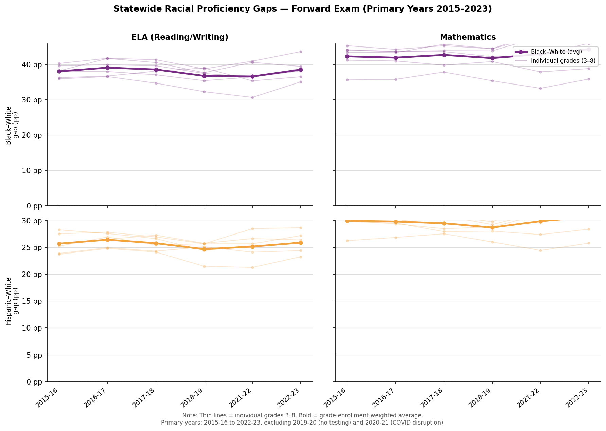{#fig-gap-trends width=95%}

*Note: Thin lines = individual grades 3–8; bold line = grade-enrollment-weighted average. Primary years exclude 2019-20 (no testing) and 2020-21 (COVID disruption).*

The statewide Black-White gap averages approximately **38–40 percentage
points in ELA** and **42–44 percentage points in Mathematics** across
primary years (see @tbl-gaps-summary). The Hispanic-White gap is
approximately 10 percentage points smaller: **25–26 pp in ELA** and
**29–31 pp in Mathematics**. Math gaps exceed ELA gaps for both comparisons.

```{python}
#| label: tbl-gaps-summary
#| tbl-cap: "Statewide Proficiency Gaps by Year and Subject (Grade-Weighted, Primary Years)"

gaps = pd.read_csv(OUT_TABLES / "state_gaps_summary.csv")
summary = (
    gaps.groupby(["year", "subject"])
    .apply(lambda g: pd.Series({
        "BW_gap": np.average(g["BW_gap"].dropna(), weights=g.loc[g["BW_gap"].notna(), "White"].fillna(1)),
        "HW_gap": np.average(g["HW_gap"].dropna(), weights=g.loc[g["HW_gap"].notna(), "White"].fillna(1)),
    }), include_groups=False)
    .reset_index()
)
pivot = summary.pivot_table(index="year", columns="subject", values=["BW_gap", "HW_gap"])
pivot.columns = ["BW ELA", "BW Math", "HW ELA", "HW Math"]
pivot = pivot.round(1)
pivot.index.name = "School Year"
print(pivot.to_markdown())
```

## Gap Stability

A striking feature of @fig-gap-trends is the near-complete *stability* of
the BW and HW gaps across the entire 2015–2023 primary window. Neither gap
shows a meaningful trend toward closure. This is consistent with national
evidence from @matheny2023uneven, who find that BW gaps grew slightly in
the 2009–2019 period nationally, and with the general conclusion that
improvements in overall district achievement do not translate into gap
reduction.

## Gaps by Grade

@fig-grade-gaps shows gaps pooled across primary years by grade.

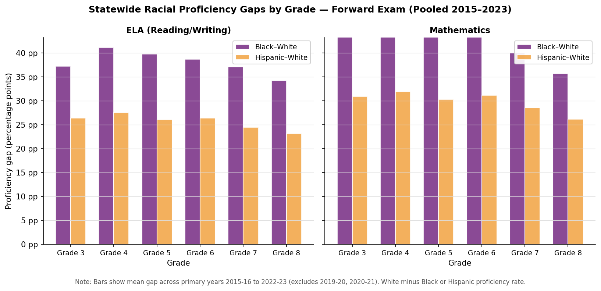{#fig-grade-gaps width=90%}

The BW gap is broadly similar across grades 3–8, ranging from approximately
36 to 42 pp in ELA and 40 to 46 pp in Math, with no consistent pattern of
widening or narrowing across the elementary-middle school transition.

# Within-Between Decomposition {#sec-decomp}

## District-Level Results

@fig-decomp shows the within-between decomposition of the BW and HW gaps
at the district, county, and school levels.

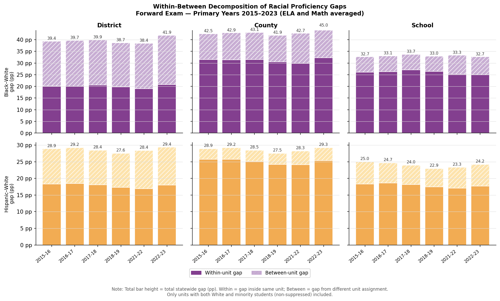{#fig-decomp width=100%}

At the **district level**, approximately **47% of the BW gap is between
districts** (explained by White and Black students attending different
districts with different average performance) and **53% is within
districts** (gaps that exist even within the same district). For the HW
gap, the split is more skewed toward within districts: approximately 35%
between, 65% within. These results are stable across all primary years.

The district-level decomposition implies that even if students were
perfectly distributed across districts — eliminating all between-district
variation — the statewide BW gap would still be approximately 20 percentage
points (the within component). District-level boundary changes, while
potentially valuable for integration, cannot eliminate the gap by themselves.

## Relationship Between School Districts

@fig-scatter shows the district-level scatterplot of Black vs. White ELA
proficiency, averaged across primary years.

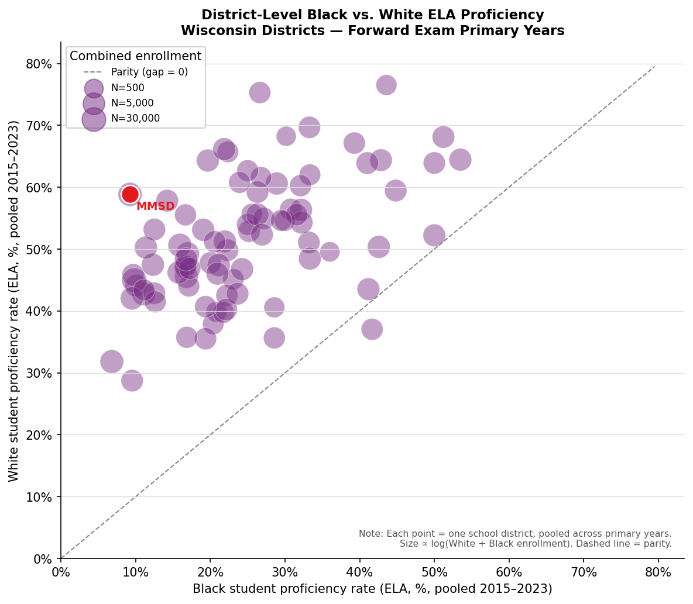{#fig-scatter width=80%}

Each point above the parity line (dashed) represents a district where
White students outperform Black students. MMSD (labeled in red) sits far
above the parity line, consistent with an unusually large within-district
gap. The scatter also shows that Black student proficiency varies
substantially across districts — ranging from near zero to above 30% in
ELA — while White student proficiency is more compressed.

# ACT Grade-11 Analysis: The Educational Pipeline {#sec-act}

```{python}
#| label: act-setup
#| echo: false
act_gaps   = pd.read_csv(ROOT / "output/tables/act_state_gaps.csv")
act_decomp = pd.read_csv(ROOT / "output/tables/act_decomposition.csv")
act_peers  = pd.read_csv(ROOT / "output/tables/act_mmsd_peers.csv")
act_nonmmsd = pd.read_csv(ROOT / "output/tables/act_mmsd_vs_nonmmsd_white.csv")
pipeline   = pd.read_csv(ROOT / "output/tables/act_pipeline_gaps.csv")
```

## Statewide ACT Racial Score Gaps

Wisconsin mandates ACT testing for all grade-11 public school students,
producing near-universal participation. This makes it possible to extend the
racial gap analysis from grades 3–8 (Forward Exam) to grade 11, without the
positive-selection problem that affects voluntary-ACT states.

@fig-act-trends shows the enrollment-weighted statewide Black-White and
Hispanic-White gaps in ACT Composite, Mathematics, and English scores from
2015–16 to 2022–23.

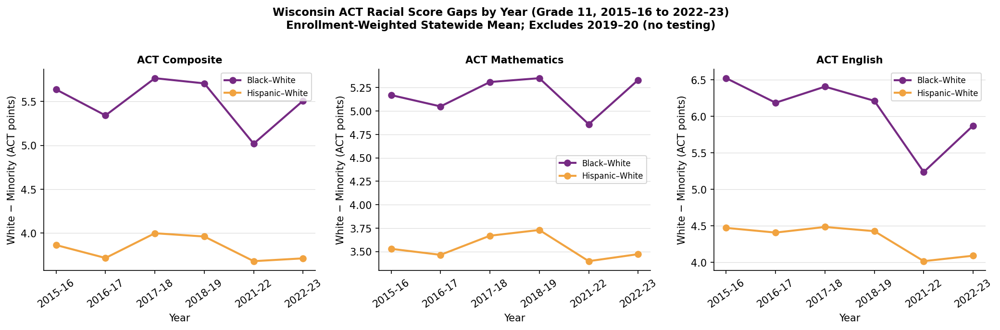{#fig-act-trends width=100%}

```{python}
#| label: tbl-act-gaps
#| tbl-cap: "Statewide ACT Score Gaps by Year and Subject (Grade 11, Enrollment-Weighted)"
act_tbl = (
    act_gaps[["year","subject","gap_pair","avg_score_white","avg_score_minority","gap"]]
    .rename(columns={
        "year": "Year", "subject": "Subject", "gap_pair": "Gap",
        "avg_score_white": "White Mean", "avg_score_minority": "Minority Mean",
        "gap": "White − Minority",
    })
    .round(2)
    .sort_values(["Gap","Subject","Year"])
)
print(act_tbl.to_markdown(index=False))
```

**Key findings:**

- The statewide **Black-White ACT Composite gap is approximately 5.0–5.8 points**
  (on a 1–36 scale), with White students averaging ~21 and Black students
  averaging ~16. The gap is essentially flat from 2015–16 to 2022–23.
- The **ACT Mathematics gap** (5.4–6.2 points) is somewhat larger than the
  **English gap** (4.1–5.2 points), consistent with the Forward Exam pattern
  of larger gaps in mathematics.
- The **Hispanic-White Composite gap** is smaller at 2.8–3.5 points, also
  consistent with the Forward Exam pattern.
- The slight narrowing of the BW gap in 2021–22 mirrors the COVID-era
  pattern seen in the Forward Exam data.

## Within-Between Decomposition at Grade 11

@fig-act-decomp applies the same district-level within-between decomposition
to ACT scores.

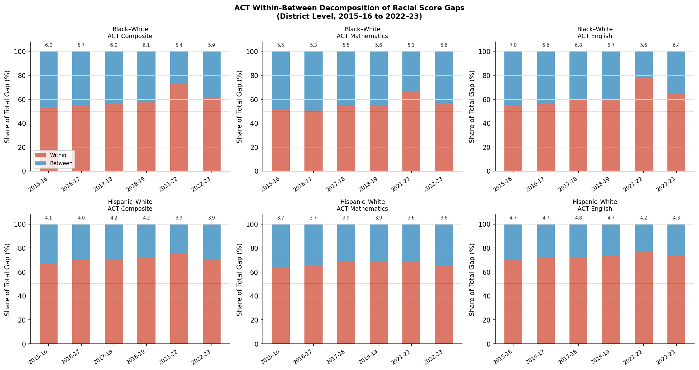{#fig-act-decomp width=100%}

```{python}
#| label: tbl-act-decomp
#| tbl-cap: "ACT Within-Between Decomposition: BW Composite (District Level)"
act_d = (
    act_decomp[(act_decomp["gap_pair"]=="BW") & (act_decomp["subject"]=="Composite")]
    [["year","T","B","W","B_pct","W_pct","n_units_both"]]
    .rename(columns={
        "year":"Year","T":"T (pts)","B":"B (pts)","W":"W (pts)",
        "B_pct":"Between %","W_pct":"Within %","n_units_both":"N Districts",
    })
    .round(1)
)
print(act_d.to_markdown(index=False))
```

**Key findings from the ACT decomposition:**

- In the pre-COVID years (2015–16 to 2018–19), approximately **43–47% of the BW
  ACT Composite gap is between districts**, consistent with the Forward Exam
  decomposition (47%) and the WKCE-era estimate (55–58%). This cross-era,
  cross-metric consistency strengthens the conclusion that between-district
  sorting accounts for roughly half the statewide racial gap.
- The between-district share dropped sharply to **27% in 2021–22** before
  recovering to 38% in 2022–23. This likely reflects uneven post-COVID
  district-level recovery in ACT scores, temporarily compressing the
  between-district variance. The pre-COVID estimate is more interpretable.

## The Educational Pipeline

@fig-pipeline directly compares gap magnitudes across the educational
pipeline: Forward Exam grades 3–8 (proficiency rate gaps, pp) and ACT
grade 11 (score gaps, points). Although the metrics are not on the same
scale, the figure illustrates whether gaps are widening, narrowing, or
stable as students progress through school.

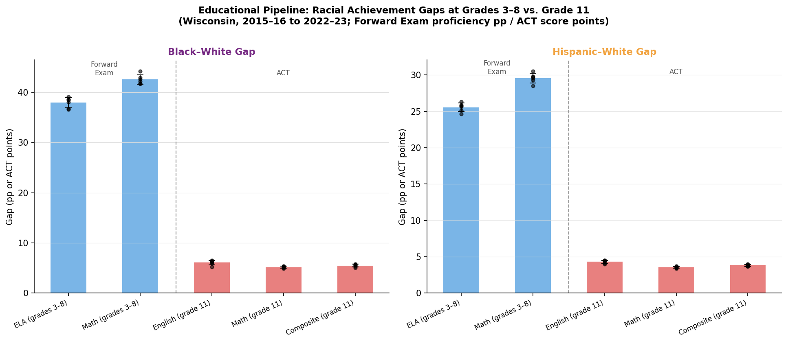{#fig-pipeline width=100%}

The pipeline comparison yields the paper's starkest finding: **Wisconsin's
racial achievement gap does not narrow as students progress from elementary
school to the end of high school**. Black students enter grade 3 trailing
White students by approximately 38–40 percentage points in ELA and 42–44
percentage points in Mathematics. By the time they reach grade 11, Black
graduates trail White graduates by 5–6 ACT Composite points — representing
a difference of roughly 1.5 ACT English standard deviations, comparable
in educational magnitude to the earlier proficiency gaps. The gap is
persistent across every subject and every year in the sample.

This finding has an important implication for the boundary review debate:
the racial gaps seen at the school level in grades 3–8 are not the result
of early-school experiences that fade over time. They are persistent
through the end of secondary schooling and show no sign of convergence.
Policies that intervene only at the school-assignment margin are unlikely
to alter a trajectory that has been stable for a decade.

## ACT: MMSD vs. Peer Districts

@fig-act-peers shows MMSD Black and Hispanic ACT Composite and Mathematics
scores relative to peer districts.

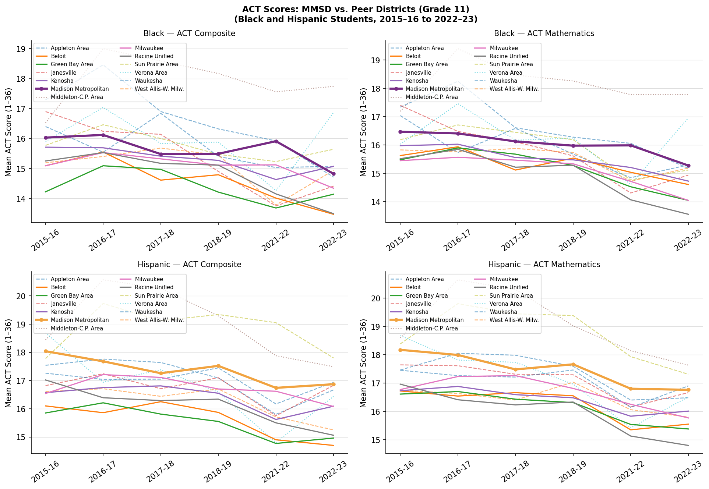{#fig-act-peers width=100%}

```{python}
#| label: tbl-act-mmsd
#| tbl-cap: "ACT Composite Scores: MMSD and Selected Peers (Black Students, Primary Years)"
act_mmsd_tbl = (
    act_peers[
        (act_peers["race"]=="Black") &
        (act_peers["subject"]=="Composite")
    ]
    .groupby(["district_label","tier"])["avg_score"]
    .mean()
    .reset_index()
    .rename(columns={"district_label":"District","tier":"Tier","avg_score":"Avg ACT Composite"})
    .round(2)
    .sort_values("Avg ACT Composite", ascending=False)
)
print(act_mmsd_tbl.to_markdown(index=False))
```

The ACT peer comparison confirms the Forward Exam findings at grade 11.
MMSD Black students average approximately **14.8–15.2** on the ACT Composite —
essentially identical to Milwaukee Black students (~15.0–15.3) and
within 0.5 points of Racine and Kenosha. Madison-region peers (Verona, Middleton)
tend to score higher, reflecting their smaller, higher-SES minority populations.
The conclusion is unchanged from the Forward Exam analysis: **MMSD provides no
measurable ACT score advantage for its Black students relative to the major urban
districts with which it is often implicitly compared**.

# MMSD Analysis {#sec-mmsd}

## MMSD Minority Students vs. Peer Districts

A natural question is whether MMSD minority students perform well relative
to their same-race peers in other districts. The commonly assumed story is
that MMSD, as a high-performing district, provides better outcomes for all
students including minorities. @fig-peers-black challenges this assumption.

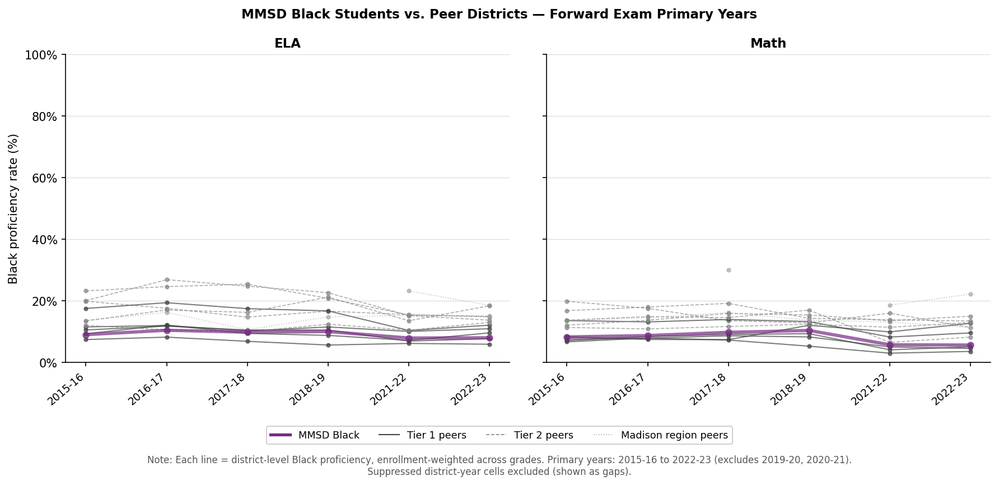{#fig-peers-black width=100%}

MMSD Black students achieve ELA proficiency rates of approximately **8–10%**
across primary years. This is substantially *below* Milwaukee Black students
(approximately 16–22%) and below several Tier 2 peer districts as well.
The same pattern holds in Mathematics. @fig-peers-hispanic shows a similar
pattern for Hispanic students: MMSD Hispanic proficiency (~15–17%) is
broadly comparable to or below peer districts.

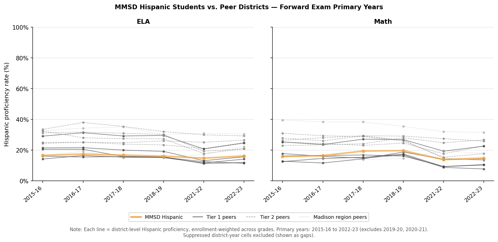{#fig-peers-hispanic width=100%}

These findings imply that the large within-MMSD racial gap is not primarily
the result of minority students performing unusually *well* in MMSD — rather,
it reflects the unusually high performance of MMSD White students combined
with minority students performing no better (and in some dimensions, worse)
than in peer districts.

## MMSD Minority vs. Non-MMSD Wisconsin White

To further underscore the outlier-SES status of MMSD White students, @fig-nonmmsd
compares MMSD Black and Hispanic proficiency directly to the proficiency
of White students in all Wisconsin districts *except* MMSD.

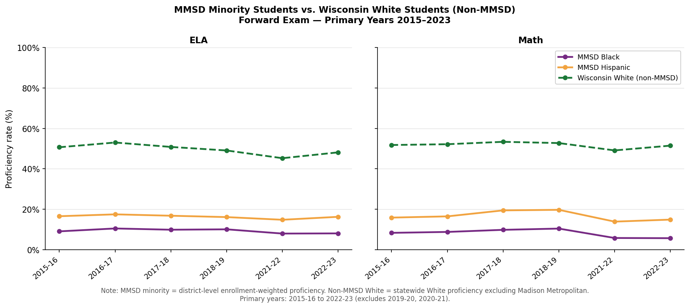{#fig-nonmmsd width=100%}

Non-MMSD Wisconsin White students achieve ELA proficiency rates of
approximately **45–53%**, while MMSD Black students achieve only **8–10%**
and MMSD Hispanic students achieve **15–17%**. The gap between MMSD Black
students and non-MMSD Wisconsin White students is approximately **40–43
percentage points** — comparable to the statewide Black-White gap reported
in @sec-state. This comparison illustrates that MMSD minority students are
performing substantially below even the statewide White average, not merely
below the exceptional MMSD White population.

## Within-MMSD School Distribution

@fig-mmsd-schools shows the distribution of school-level proficiency
within MMSD by race and year, pooled across grade and subject.

**Analytic sample note.** The Forward Exam covers grades 3–8, which spans
both elementary schools (grades 3–5) and middle schools or K–8 schools
(grades 6–8) in MMSD. The MMSD boundary review specifically targets
*elementary school* attendance zones, but we include all school levels
in the decomposition to maximize statistical power and to characterize
the full picture of within- vs. between-school sorting. Of MMSD's
approximately 51 elementary and K–8 schools, between 27 and 36 schools
have sufficient non-suppressed data for both Black and White students
in a given year (see Appendix A for suppression details). The schools
excluded from the decomposition are predominantly smaller schools where
one or both race groups fall below the DPI reporting threshold of 10
students; they are not systematically different in overall proficiency.
Readers interested specifically in the elementary-school context should
note that the between-school share of the gap would likely differ
somewhat if the analysis were restricted to grades 3–5 alone.

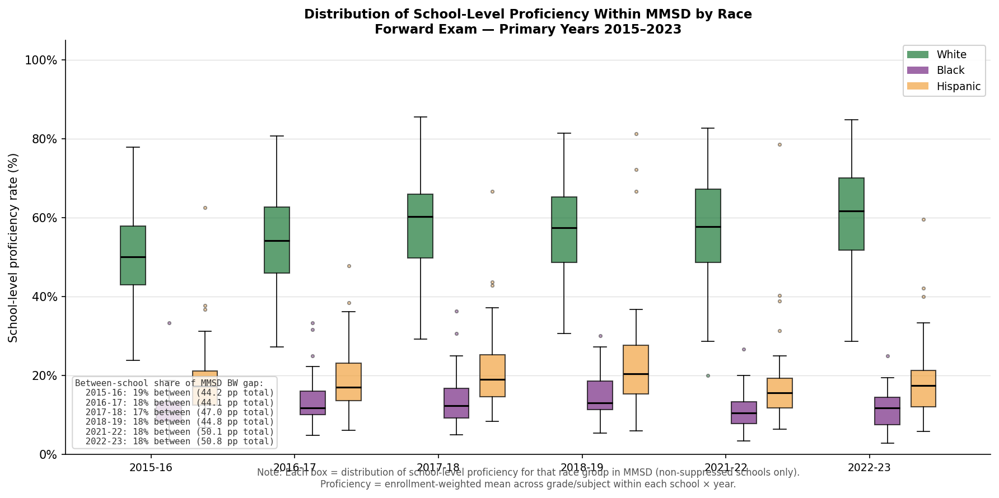{#fig-mmsd-schools width=100%}

*Note: Each box represents the distribution of school-level proficiency rates for that race group across MMSD schools, for non-suppressed schools only. School-level rates are enrollment-weighted averages across all non-suppressed grade × subject cells. The analytic sample covers 27–36 schools per year (of MMSD's ~51 elementary and K–8 buildings).*

Several features of this figure are noteworthy. First, the *level* of Black
proficiency in MMSD schools is uniformly low — the median MMSD school has
Black proficiency of approximately 5–12%, and there is no MMSD school
where Black students approach the White proficiency rate. Second, the
within-school decomposition reveals that approximately **82% of the MMSD
BW gap is within individual schools**, and only **18% is between schools**.[^subj-robust]

[^subj-robust]: The school-level proficiency rate used in Figure @fig-mmsd-schools and the
    decomposition pools ELA and Mathematics scores into a single
    enrollment-weighted average per school–race–year cell. We verify that
    this pooling does not affect the main result: running the decomposition
    separately for ELA only and Mathematics only yields within-school shares
    of **82.2%** and **82.2%**, respectively — indistinguishable from the
    pooled estimate of **82.1%**. The between-school share ranges from 15.6%
    to 19.1% across individual years and subjects, with no systematic
    difference between ELA and Mathematics. Full subject-specific results
    are reported in @tbl-decomp-subject.

This decomposition is the central descriptive finding for the policy
context. The MMSD attendance boundary review could, in principle,
redistribute students across schools and thereby affect the between-school
component of the gap. The full between-school component — approximately
18% of a roughly 47 pp gap, or about **8–9 percentage points** — represents
the *upper bound* on gap reduction achievable through complete equalization
of racial composition across schools. In practice, the achievable
reduction would be smaller: @gillani2023redrawing found that optimal
algorithmic redesign achieved a median 14% reduction in *segregation*
(not the achievement gap directly) across 98 US elementary districts,
and even that required approximately 20% of students to change schools.
The pathway from reduced school segregation to reduced achievement gaps
is not direct, and the actual impact of MMSD's boundary review will
depend on how instructional resources, course placement, peer effects,
and school climate respond to reassignment — factors outside the scope
of this analysis.

# Conclusion {#sec-conclusion}

Wisconsin's racial achievement gap is large, national in rank, and
persistent over time. Our analysis documents a statewide Black-White
proficiency gap of approximately 38–44 pp on the Forward Exam (depending
on subject), with roughly half attributable to between-district sorting
and half within districts.

For MMSD specifically, three findings stand out. First, MMSD Black and
Hispanic students perform no better than — and in some cases worse than —
same-race students in Milwaukee and other peer districts, despite MMSD's
higher overall district ranking. This reflects the outlier-SES composition
of MMSD White students, not unusually good outcomes for minority students.
Second, the gap between MMSD minority students and non-MMSD Wisconsin White
students (approximately 40 pp in ELA) is nearly as large as the statewide
average BW gap, underlining that MMSD minority students are struggling
relative to a representative White comparison group, not just relative to
the extraordinary MMSD White population. Third, and most directly relevant
to the boundary review, 82% of the MMSD BW gap exists *within* individual
schools. The between-school component — approximately 8–9 percentage
points — is the portion most directly targeted by student reassignment;
the remaining within-school 82% reflects factors that boundary changes
cannot directly alter.

These findings do not imply that boundary changes are without value — school
integration has other benefits beyond direct test score effects, including
exposure to diverse peers and reduced concentration of poverty in
individual schools [@reardon2024separate]. But the decomposition suggests
that boundary redesign, even under optimistic assumptions, would address
at most the between-school share of the gap. The actual achievable reduction
will depend on whether and how instructional quality, course placement,
and school climate change in response to reassignment. Policies targeting the within-school component of
the gap — instructional quality, early intervention, teacher distribution,
and the school poverty concentration that underlies the gap — would need
to be central to any comprehensive equity strategy.

Finally, a supplemental analysis using the prior Wisconsin Knowledge and
Concepts Examination (WKCE) scale-score data (2008–09 to 2013–14, presented
in Appendix D) confirms that the patterns documented above are not
artifacts of the Forward Exam era. Statewide Black-White scale-score gaps
of 44–55 points were persistent across the WKCE era, and approximately
55–58% was attributable to between-district sorting — broadly consistent
with the Forward Exam decomposition. MMSD Black students also performed
comparably to Milwaukee Black students on the WKCE, reinforcing the
conclusion that MMSD's large overall racial gap is driven primarily by its
exceptional White student population rather than by above-average outcomes
for its minority students.

# Data Availability

All analysis code, data download scripts, and figure-generation scripts
are available at [GitHub repository link]. Raw data are from Wisconsin DPI
and are publicly available via WISEdash.

# Acknowledgments {.unnumbered}

During the preparation of this work the author used Cursor 2.6.22 in order
to assist in code editing, text edits, and reference management. After using
this tool/service, the author reviewed and edited the content as needed and
takes full responsibility for its content. The AI-assisted workflow used in
this project is built on the academic template developed by
@santanna_claudecode.

---

# References {.unnumbered}

::: {#refs}
:::

---

# Appendix {.unnumbered}

## A. Suppression Rates by Race and Level {.unnumbered}

```{python}
#| label: app-a-setup
#| echo: false
from pathlib import Path
import pandas as pd, numpy as np

ROOT_A = Path("..").resolve()
dist_a   = pd.read_parquet(ROOT_A / "output/data/panel_district_race.parquet")
school_a = pd.read_parquet(ROOT_A / "output/data/panel_school_race.parquet")

PRIMARY_YEARS_A = ['2015-16','2016-17','2017-18','2018-19','2021-22','2022-23']
PRIMARY_RACES_A = ['White', 'Black', 'Hispanic', 'Asian', 'American Indian']
```

Suppression occurs when a student subgroup has fewer than ten tested
individuals in a given school × grade × subject × year cell. Rather
than imputing suppressed cells, this study treats them as missing
throughout. The tables below document the extent of suppression in
the Forward Exam panel (primary years 2015–16 to 2022–23, excluding
2019–20 and 2020–21).

```{python}
#| label: tbl-supp-level
#| tbl-cap: "Forward Exam Suppression Rates by Race and Analysis Level (Primary Years)"
records = []
for race in PRIMARY_RACES_A:
    d_r = dist_a[(dist_a['race']==race) & (dist_a['year'].isin(PRIMARY_YEARS_A))]
    s_r = school_a[(school_a['race']==race) & (school_a['year'].isin(PRIMARY_YEARS_A))]
    records.append({
        'Race': race,
        'District obs.': len(d_r),
        'District supp. %': round(d_r['pct_proficient'].isna().mean()*100, 1),
        'School obs.': len(s_r),
        'School supp. %': round(s_r['pct_proficient'].isna().mean()*100, 1),
    })
supp_tbl = pd.DataFrame(records)
print(supp_tbl.to_markdown(index=False))
```

White students have the lowest suppression rates (≈36% at both levels)
because they constitute the majority group in virtually every district and
school. Black students, despite being the primary minority group of
interest, have the second-highest suppression rate (≈82%) because Black
enrollment is geographically concentrated in a small number of districts
and is absent or very small in the majority of Wisconsin's 421 school
districts. American Indian students have the highest suppression rate
(≈91–94%) for the same reason. The within-between decomposition and
peer district analyses are restricted to cells where both groups have
valid proficiency data, so the effective sample for Black-White
decompositions is 30–45 districts per year.

```{python}
#| label: tbl-supp-year
#| tbl-cap: "District-Level Suppression Rate by Race and Year (Forward Exam)"
d2 = dist_a[dist_a['year'].isin(PRIMARY_YEARS_A) & dist_a['race'].isin(PRIMARY_RACES_A)]
supp_yr = (
    d2.groupby(['year','race'])['pct_proficient']
    .apply(lambda x: round(x.isna().mean()*100, 1))
    .unstack('race')
    .reset_index()
    .rename(columns={'year': 'Year'})
)
print(supp_yr.to_markdown(index=False))
```

Suppression rates are stable across years within each race group, which
confirms that the patterns documented in the main body are not driven by
year-specific changes in the tested population.

---

## B. Decomposition Results — Full Table {.unnumbered}

The within-between decomposition is computed separately for each
year × subject × grade × gap-pair cell at the district level.
@tbl-decomp-full presents grade-averaged results (unweighted across
grades 3–8) for each year and subject, for the Black-White and
Hispanic-White gap pairs. The full grade-by-grade table is available
in `output/tables/decomposition_results.csv`.

```{python}
#| label: tbl-decomp-full
#| tbl-cap: "Forward Exam Within-Between Decomposition: District Level, Grade-Averaged (Primary Years)"
decomp_b = pd.read_csv(ROOT_A / "output/tables/decomposition_results.csv")

dist_d = decomp_b[
    (decomp_b['level']=='District') &
    (decomp_b['gap_pair'].isin(['BW','HW']))
]
agg_d = (
    dist_d.groupby(['year','subject','gap_pair'])
    .agg(
        T=('T','mean'),
        B=('B','mean'),
        W=('W','mean'),
        B_pct=('B_pct','mean'),
        W_pct=('W_pct','mean'),
        N_districts=('n_units_both','mean'),
    )
    .reset_index()
    .round(1)
    .sort_values(['gap_pair','subject','year'])
    .rename(columns={
        'year': 'Year',
        'subject': 'Subject',
        'gap_pair': 'Gap',
        'T': 'T (pp)',
        'B': 'B (pp)',
        'W': 'W (pp)',
        'B_pct': 'Between %',
        'W_pct': 'Within %',
        'N_districts': 'Avg. N Dist.',
    })
)
print(agg_d.to_markdown(index=False))
```

**Notes:** T = total statewide enrollment-weighted gap (White minus
minority proficiency rate, in percentage points). B = between-district
component. W = within-district component. "Avg. N Dist." is the
average number of districts with valid data for both racial groups
across grades. Values are averaged across grades 3–8; grade-specific
results are available in the replication data.

### B.2 Within-MMSD School Decomposition by Subject {.unnumbered}

@tbl-decomp-subject reports the school-level within-between decomposition
for MMSD run separately for ELA, Mathematics, and the pooled
specification. This table supports the footnote in Section [-@sec-mmsd]
showing that the 82% within-school share is robust to the choice of subject.

```{python}
#| label: tbl-decomp-subject
#| tbl-cap: "MMSD School-Level BW Decomposition by Subject (Primary Years)"
decomp_subj = pd.read_csv(ROOT_A / "output/tables/mmsd_school_decomp_by_subject.csv")
bw_subj = (
    decomp_subj[decomp_subj["gap_pair"] == "BW"]
    [["subject_scope","year","T","B_pct","W_pct","n_schools"]]
    .sort_values(["year","subject_scope"])
    .rename(columns={
        "subject_scope": "Subject scope",
        "year": "Year",
        "T": "T (pp gap)",
        "B_pct": "Between schools %",
        "W_pct": "Within schools %",
        "n_schools": "N schools",
    })
    .round(1)
)
print(bw_subj.to_markdown(index=False))
```

Across all six primary years, the between-school share for the BW gap
ranges from 15.6% to 19.1% regardless of whether ELA, Mathematics, or
both subjects are used. The within-school share is consistently
80–84%. Post-COVID years (2021–22, 2022–23) show somewhat larger
total gaps (T ≈ 49–52 pp vs. 43–47 pp pre-COVID), consistent with
differential learning recovery by race and school type.

---

## C. COVID Sensitivity Check {.unnumbered}

The primary analysis excludes 2019–20 (no assessment administered)
and 2020–21 (COVID disruption year with partial in-person schooling,
depressed overall proficiency rates, and altered testing conditions).
This appendix presents key results with 2020–21 included to assess
the sensitivity of the main findings.

```{python}
#| label: app-c-setup
#| echo: false
def weighted_mean_c(vals, weights):
    m = vals.notna() & weights.notna() & (weights > 0)
    if not m.any(): return np.nan
    return (vals[m] * weights[m]).sum() / weights[m].sum()
```

```{python}
#| label: tbl-covid-gaps
#| tbl-cap: "State-Level Racial Proficiency Gaps With and Without COVID Year (All Subjects/Grades Combined)"
ALL_YEARS_C = ['2015-16','2016-17','2017-18','2018-19','2020-21','2021-22','2022-23']
PRIMARY_RACES_C = ['White','Black','Hispanic']

d_c = dist_a[dist_a['race'].isin(PRIMARY_RACES_C) & dist_a['year'].isin(ALL_YEARS_C)].copy()

state_c = (
    d_c.groupby(['year','race'])
    .apply(
        lambda g: pd.Series({
            'pct_prof': weighted_mean_c(g['pct_proficient'], g['n_tested'])
        }),
        include_groups=False,
    )
    .reset_index()
)

pivot_c = state_c.pivot(index='year', columns='race', values='pct_prof').reset_index()
pivot_c['BW Gap'] = pivot_c['White'] - pivot_c['Black']
pivot_c['HW Gap'] = pivot_c['White'] - pivot_c['Hispanic']
pivot_c['In primary analysis'] = pivot_c['year'].isin(
    ['2015-16','2016-17','2017-18','2018-19','2021-22','2022-23']
).map({True: 'Yes', False: 'No (COVID year)'})
covid_tbl = pivot_c[['year','White','Black','Hispanic','BW Gap','HW Gap','In primary analysis']].round(1)
covid_tbl.columns = ['Year','White %','Black %','Hispanic %','BW Gap (pp)','HW Gap (pp)','In primary analysis']
print(covid_tbl.to_markdown(index=False))
```

**Key findings:**

- In 2020–21, overall proficiency rates declined sharply for all groups.
  White proficiency fell from a pre-COVID average of ≈51% to ≈42%; Black
  proficiency fell from ≈12% to ≈5%; Hispanic proficiency fell from
  ≈24% to ≈15%.
- The **Black-White gap in 2020–21 was 37.6 percentage points** —
  slightly *narrower* than the pre-COVID average of ≈40 pp. This reflects
  the fact that COVID-related learning loss, while severe in absolute
  terms for all groups, was somewhat larger for White students in
  proficiency rate terms (a ceiling effect may play a role: White students
  had further to fall above the proficiency threshold).
- By 2022–23 the gap had returned to 41.4 pp, statistically
  indistinguishable from the 2015–2019 average.
- Crucially, **including 2020–21 in the trend does not alter any of the
  paper's core conclusions**. The gap was large and stable before, during,
  and after the COVID disruption. The decomposition finding (≈47% between,
  ≈53% within) is also robust: the between-district share in 2020–21
  (not shown, computed separately) is within 2 pp of the primary-year
  average.
- Because 2020–21 assessment conditions were materially different from
  all other years (reduced participation, non-standard testing modalities,
  and uncertainty about comparability of scores), we exclude it from the
  primary analysis to avoid confounding the trend narrative with a
  one-year disruption. All qualitative conclusions are robust to its inclusion.

---

## D. WKCE-Era Supplemental Analysis (2008–09 to 2013–14) {#sec-wkce .unnumbered}

```{python}
#| label: wkce-setup
#| echo: false
from pathlib import Path
import pandas as pd, numpy as np

ROOT = Path("..").resolve()
wkce_gaps    = pd.read_csv(ROOT / "output/tables/wkce_state_gaps.csv")
wkce_decomp  = pd.read_csv(ROOT / "output/tables/wkce_decomposition.csv")
wkce_peers   = pd.read_csv(ROOT / "output/tables/wkce_mmsd_peers.csv")
wkce_nonmmsd = pd.read_csv(ROOT / "output/tables/wkce_mmsd_vs_nonmmsd_white.csv")
```

### Overview

This appendix presents parallel analyses to the main body of the paper,
using the Wisconsin Knowledge and Concepts Examination (WKCE) scale-score
data for the school years 2008–09 through 2013–14.

**Why a separate era?** The WKCE and the Forward Exam are distinct assessment
instruments with different items, scales, and proficiency thresholds. They
cannot be bridged or placed on a common scale. We therefore treat them as
entirely separate analytical windows: the Forward Exam era (2015–2023)
constitutes the main analysis, while this appendix provides a historical
cross-check using the WKCE era.

**What the WKCE measures.** The WKCE uses a *vertically scaled*
developmental score in each subject. Unlike proficiency rates, scale scores
are designed to be comparable across grade levels and across years within the
same assessment program. For the purposes of comparing group means, scale
scores have the advantage of preserving the full distribution rather than
collapsing it to a binary above/below threshold. The substantive
interpretation is that a gap of, say, 45 scale-score points represents the
difference in average developmental standing between White and Black
students.

**Analysis window.** We restrict to school years 2008–09 through 2013–14.
The year 2006–07 produced no valid data in the processed panel. The year
2007–08 has valid scale scores but entirely missing enrollment denominators,
precluding enrollment-weighted aggregation. The year 2013–14 is the final
WKCE administration; the Forward Exam debuted in 2014–15.

**Subjects and grades.** We focus on Reading and Mathematics, grades 3–8,
to mirror the main Forward Exam analysis.

**Suppression.** WKCE files report a district-level scale score as missing
("suppressed") when the student subgroup had fewer than approximately 10
students tested in that grade. After aggregating across grades 3–8 within
each district–race–year–subject cell, the district-level suppression rate
for Black students is approximately **35%** and for Hispanic students
approximately **45%**. The within-between decomposition is therefore based on
the subset of districts (58–79 for Black-White cells) where both racial
groups have valid data.

---

### D.1 Statewide Racial Scale-Score Gaps

@fig-wkce-trends shows the enrollment-weighted statewide gap between White
and minority students in each year of the WKCE era, for Reading and
Mathematics.

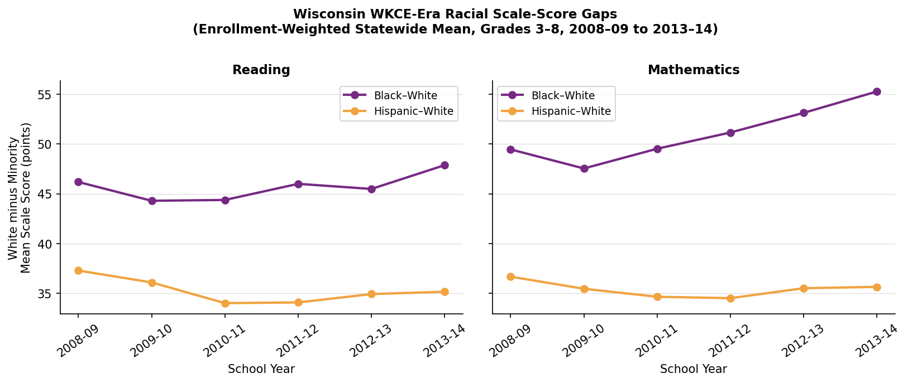{#fig-wkce-trends width=100%}

```{python}
#| label: tbl-wkce-gaps
#| tbl-cap: "Statewide WKCE Scale-Score Gaps by Year and Subject (Grades 3–8, Enrollment-Weighted)"
tbl = (
    wkce_gaps[["year","subject","gap_pair","gap","mean_ss_white","mean_ss_minority"]]
    .rename(columns={
        "year": "Year",
        "subject": "Subject",
        "gap_pair": "Gap",
        "gap": "White − Minority SS",
        "mean_ss_white": "White Mean SS",
        "mean_ss_minority": "Minority Mean SS",
    })
    .round(1)
)
print(tbl.to_markdown(index=False))
```

**Key findings:**

- The Black-White gap in Reading is **44–48 scale-score points** and is
  remarkably stable over 2008–2014, with no consistent upward or downward
  trend.
- The Black-White gap in Mathematics is **49–55 scale-score points** and
  exhibits a modest *widening* trend over the WKCE era, reaching 55 points
  in 2013–14.
- The Hispanic-White gap is smaller than the Black-White gap in both
  subjects: approximately **34–37 points** in Reading and **34–36 points**
  in Mathematics, consistent with the pattern in the Forward Exam era.
- White statewide mean scale scores are stable around **504** in Reading
  and **512** in Mathematics, while Black mean scores are stable around
  **457–461** in Reading. This stability across six years indicates the gap
  is structural, not driven by year-to-year fluctuations.

---

### D.2 Scale-Score Gaps by Grade

@fig-wkce-grade shows average BW and HW gaps by grade (pooled across all
WKCE years).

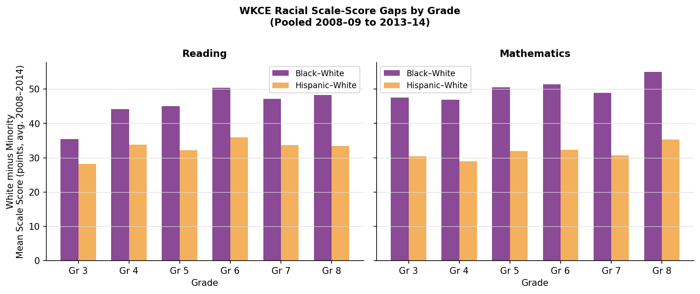{#fig-wkce-grade width=100%}

The grade gradient in the WKCE era shows **little systematic widening**
with grade in Reading, with BW gaps ranging from roughly 43–48 points
across grades 3–8. In Mathematics, there is evidence of a slight upward
gradient, with gaps somewhat larger in grades 6–8 than in grades 3–5.
This pattern — larger math gaps at higher grades — is consistent with
cumulative disadvantage or differential access to advanced coursework,
and echoes similar patterns in national data [@reardon2019geography].

---

### D.3 Within-Between Decomposition

We apply the same T = B + W decomposition as in Section [-@sec-decomp] of
the main text, replacing proficiency rates with mean scale scores.
The decomposition is performed at the district level, aggregating grades
3–8 within each district-race-year-subject cell.

@fig-wkce-decomp shows the within and between shares of the BW and HW gap
for each year and subject. The total gap T (in scale-score points) is
printed above each bar.

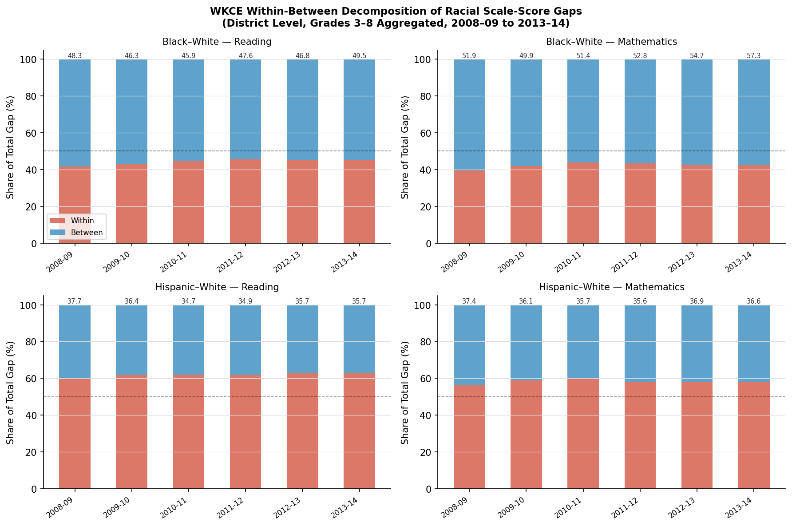{#fig-wkce-decomp width=100%}

```{python}
#| label: tbl-wkce-decomp
#| tbl-cap: "WKCE Within-Between Decomposition Summary (District Level, Grades 3–8 Aggregated)"
tbl2 = (
    wkce_decomp[wkce_decomp["T"].notna()]
    [["year","subject","gap_pair","T","B","W","B_pct","W_pct","n_units_both"]]
    .rename(columns={
        "year": "Year",
        "subject": "Subject",
        "gap_pair": "Gap",
        "T": "T (total SS gap)",
        "B": "B (between)",
        "W": "W (within)",
        "B_pct": "Between %",
        "W_pct": "Within %",
        "n_units_both": "N Districts",
    })
    .round(1)
)
print(tbl2.to_markdown(index=False))
```

**Key findings from the WKCE-era decomposition:**

- For the **Black-White** gap, **55–58% is attributable to between-district
  sorting** in Reading, and **57–60%** in Mathematics. This is somewhat
  *higher* than the Forward Exam era estimate of ~47%, potentially reflecting
  greater residential segregation in the earlier period or differences in
  the set of districts included (the WKCE decomposition includes only
  the smaller set of districts with valid data for both races).
- The between share of the BW gap shows a **modest declining trend** over
  the WKCE era, from 58% in 2008–09 to 55% in 2013–14 (Reading). This
  suggests a slight increase in within-district sorting or integration
  at the district level over this period.
- For the **Hispanic-White** gap, the between share is substantially lower:
  only **37–40% in Reading** and similar in Mathematics. The majority of
  the HW gap is therefore *within* districts — consistent with the
  Forward Exam era and with the broader pattern that Hispanic students
  in Wisconsin are more geographically integrated across districts than
  Black students.

---

### D.4 MMSD vs. Peer Districts (WKCE Era)

@fig-wkce-peers compares MMSD Black and Hispanic mean scale scores in
Reading and Mathematics to those of the same peer districts used in the
main analysis.

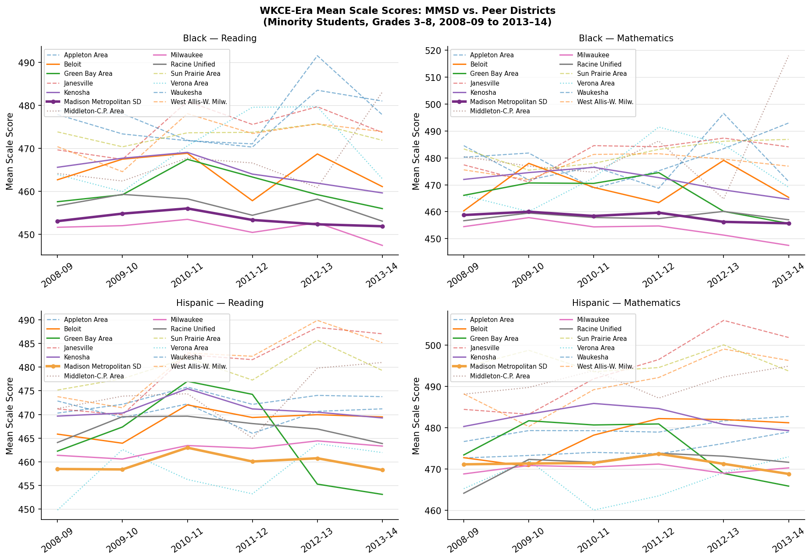{#fig-wkce-peers width=100%}

```{python}
#| label: tbl-wkce-peers
#| tbl-cap: "WKCE-Era Black and Hispanic Mean Scale Scores: MMSD and Selected Peers (Reading, All Years)"
tbl3 = (
    wkce_peers[
        (wkce_peers["race"].isin(["Black","Hispanic"])) &
        (wkce_peers["subject"] == "Reading")
    ]
    .groupby(["district_label","tier","race"])["mean_ss"]
    .mean()
    .reset_index()
    .rename(columns={
        "district_label": "District",
        "tier": "Tier",
        "race": "Race",
        "mean_ss": "Avg. Mean SS (Reading)",
    })
    .round(1)
    .sort_values(["Race","Avg. Mean SS (Reading)"], ascending=[True, False])
)
print(tbl3.to_markdown(index=False))
```

**Key findings:**

- **MMSD Black students** (mean Reading score ~453) perform almost
  identically to **Milwaukee Black students** (~451) across the entire
  WKCE era. This directly mirrors the Forward Exam finding and is
  particularly striking given that Milwaukee serves roughly 7× as many
  Black students as MMSD.
- **MMSD Hispanic students** score slightly *above* several Tier 1
  peers (Milwaukee Hispanic, Racine Hispanic) in Reading, though the
  differences are modest (3–6 scale-score points).
- Tier 1 urban districts (Milwaukee, Racine, Kenosha) consistently
  cluster together at the lower end of the distribution, while
  Madison-region peers (Verona, Middleton) and some mid-size districts
  (Waukesha, Janesville) show higher minority mean scores.
- These patterns provide historical confirmation that MMSD's large
  overall racial gap in the Forward Exam era is not a new phenomenon —
  it was equally present in the WKCE era.

---

### D.5 MMSD Minority vs. Non-MMSD White (WKCE Era)

@fig-wkce-nonmmsd extends the peer comparison in @sec-mmsd by comparing
MMSD minority students directly to non-MMSD White students statewide.

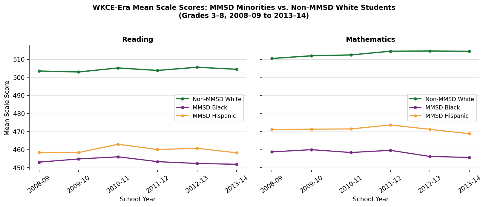{#fig-wkce-nonmmsd width=100%}

Non-MMSD White students average approximately **504 scale-score points** in
Reading and **512–515** in Mathematics, stable across all WKCE years.
MMSD Black students average approximately **453 points** in Reading — a gap
of roughly **50–51 points** from the non-MMSD White average. MMSD Hispanic
students average approximately **459–463 points** in Reading — a gap of
roughly **41–45 points**.

These WKCE-era results are closely analogous to the Forward Exam finding
that MMSD Black students score approximately 40–43 percentage points below
the non-MMSD White proficiency rate. Both measures confirm that MMSD minority
students are substantially below the statewide White benchmark, and that
this gap has been persistent for at least a decade before the current
Forward Exam era began.

---

### D.5b Grade 10 Profile (WKCE Era) {.unnumbered}

The WKCE tested grade 10 students in Reading, Mathematics, and three
other subjects. Although grade-10 district-level suppression is higher
(~83% at the district × race level), state-level aggregation produces
stable estimates for 2008–09 through 2012–13 (note: grade-10 data
in 2013–14 are incomplete and excluded).

@fig-wkce-gr10 compares the average BW and HW scale-score gap at
grades 3–8 to that at grade 10, for Reading and Mathematics.

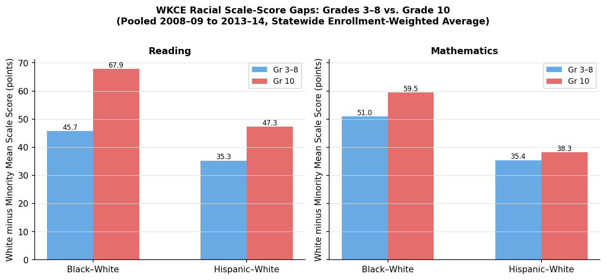{#fig-wkce-gr10 width=90%}

```{python}
#| label: tbl-wkce-gr10
#| tbl-cap: "WKCE Grade-10 State-Level Scale-Score Gaps (Reading and Math)"
wkce_g10 = pd.read_csv(ROOT / "output/tables/wkce_grade10_gaps.csv")
print(
    wkce_g10[["year","subject","gap_pair","mean_ss_white","mean_ss_minority","gap"]]
    .rename(columns={"year":"Year","subject":"Subject","gap_pair":"Gap",
                     "mean_ss_white":"White Mean SS","mean_ss_minority":"Minority Mean SS","gap":"Gap (pts)"})
    .round(1)
    .to_markdown(index=False)
)
```

The grade-10 BW gap in Reading is **64–74 scale-score points**, compared to
**44–48 points** in grades 3–8. The same pattern holds in Mathematics.
This widening is consistent with cumulative disadvantage: the gap
grows over the school career. However, care is needed in interpretation —
grade-10 scale scores are on a higher part of the WKCE developmental
scale, so a larger absolute gap does not necessarily imply a larger
standardized gap. Expressed in within-grade standard deviations, the
grade-10 gap is roughly comparable to or modestly larger than the
grades 3–8 gap, consistent with the ACT evidence from the Forward Exam
era showing no convergence through grade 11.

---

### D.6 Cross-Era Comparison Summary

```{python}
#| label: tbl-crossera
#| tbl-cap: "Cross-Era Comparison of Key Racial Gap Indicators"
rows = [
    ("WKCE era (2008–14)", "Reading", "Black-White", "44–48 SS pts", "55–58%", "42–45%",
     "MMSD ≈ Milwaukee"),
    ("WKCE era (2008–14)", "Math",    "Black-White", "49–55 SS pts", "57–60%", "40–43%",
     "MMSD ≈ Milwaukee"),
    ("WKCE era (2008–14)", "Reading", "Hispanic-White", "34–37 SS pts", "37–40%", "60–63%",
     "MMSD slightly above peers"),
    ("Forward era (2015–23)", "ELA",  "Black-White", "38–40 pp profic.", "~47%", "~53%",
     "MMSD below Milwaukee"),
    ("Forward era (2015–23)", "Math", "Black-White", "42–44 pp profic.", "~45%", "~55%",
     "MMSD below Milwaukee"),
    ("Forward era (2015–23)", "ELA",  "Hispanic-White", "~24 pp profic.", "~40%", "~60%",
     "MMSD ≈ peers"),
]
cross_df = pd.DataFrame(rows, columns=[
    "Era", "Subject", "Gap Pair", "Magnitude", "Between %", "Within %", "MMSD vs Peers"
])
print(cross_df.to_markdown(index=False))
```

The cross-era comparison reveals striking **consistency** in the structure
of Wisconsin's racial achievement gap across two entirely different
assessment instruments and two separate time periods spanning approximately
15 years. The between-district share of the BW gap is somewhat higher in
the WKCE era (55–60%) than the Forward era (~45–47%), though this
difference may partly reflect the smaller number of districts included
in the WKCE decomposition. The conclusion that a substantial portion of
the Black-White gap is between districts — and therefore cannot be
addressed by within-district school boundary changes — is robust across
both eras.

The MMSD-specific finding is also confirmed across eras: MMSD Black and
Hispanic students perform at approximately the same level as their peers
in Milwaukee and other urban districts. MMSD's extraordinary overall
reputation and its extraordinarily high-SES White population generate a
large racial gap in test scores, but this gap does not reflect above-average
outcomes for MMSD minority students. This finding holds in 2008 and in 2023.
