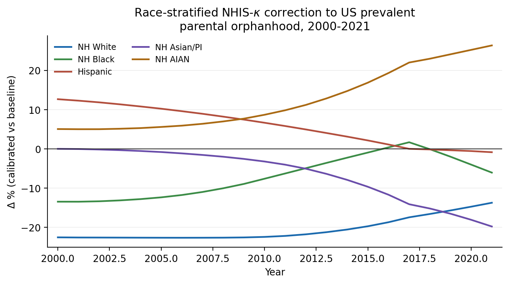
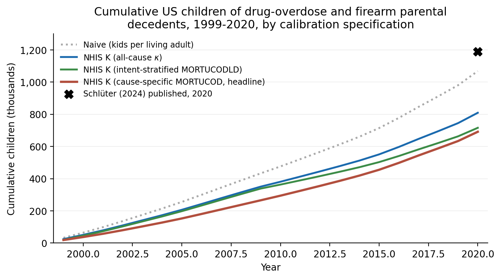

# Calibrating US Orphanhood Estimates with Decedent-Level Co-Resident Children: Evidence from the NHIS Linked Mortality File, 1986-2018

**Author:** Jason M. Fletcher [affiliation TK]
**Date:** May 2026
**Keywords:** orphanhood; bereavement demography; matrix kinship; National Health Interview Survey; National Death Index; cause of death; non-resident parents; deaths of despair

---

## Abstract

When the bereavement-demography field reports 1.19 million US children orphaned by drug overdose and firearm violence over 1999-2020 (Schlüter et al., 2024), the number is a calculation, not a count. The calculation multiplies parental death counts by the dependent-child schedule of *average same-cell adults* -- adults who did not die -- on the assumption that decedents have the same family configuration as survivors of the same age, sex, race / ethnicity, and year. The assumption is treated as a parametric sensitivity. It has never been measured.

Using the NHIS Linked Mortality File 1986-2018, we measure it. Within the demographic cells the published literature uses, the cumulative count of US children of drug-overdose and firearm parental decedents 1999-2020 is **691,000** under our preferred specification -- **42 % below the published 1.19 million**. The correction is robust across four NHIS calibration paths and survives a transparent back-of-envelope augmentation for non-resident fathers. For the Villaveces et al. (2025) all-cause 2021 prevalent estimate, the pooled US correction is small (-3 %) -- but race-stratified corrections range from **-20 % for non-Hispanic Asian / Pacific Islander children** to **+26 % for non-Hispanic American Indian or Alaska Native children**, with **-14 %** for non-Hispanic White, **-6 %** for non-Hispanic Black, and **-1 %** for Hispanic children. The pooled headline is approximately right by accident; the cell-level structure is systematically wrong.

A more subtle point. The calibration effect is structurally driven by *household composition* on the day of death, not by within-cell biological-fertility heterogeneity. Single-adult parents face 1.3-1.9× the mortality of coupled parents in every race × sex cell in NHIS-LMF and have lower co-resident-child counts at the survey address; decedents are over-represented in single-parent households, and that is what drives $\kappa < 1$ in most cells. The published estimates therefore answer a *custodial-orphanhood* question with *biological-orphanhood* inputs. These are different concepts. We argue the field should report two numbers per paper -- and label them.

---

## 1. Introduction

The US bereavement-demography literature has matured rapidly since 2021. Villaveces et al. (2025) report 2.91 million US children with a deceased parent or caregiver-grandparent in 2021. Schlüter et al. (2024) report 1.19 million cumulative children of drug-overdose or firearm parental decedents over 1999-2020. Potter et al. (2025), Verdery et al. (2024), Hillis et al. (2021, 2022), and the *Annual Review of Sociology* essay of Smith-Greenaway, Verdery, & Carr (2025) round out a field that has grown from a handful of papers to a body of work in five years.

These estimates share a modeling architecture and an assumption. The architecture is the matrix-kinship recurrence of Caswell (2019, 2020) and Caswell and Song (2021), operationalized for applied research in the `DemoKin` R package (Williams, Sánchez Pérez, & Alburez-Gutiérrez, 2023). The assumption is that within demographic cells defined by parent age, sex, race / ethnicity, year, and sometimes geography, **adults who die during the modeling horizon have the same dependent-child count as adults who survive.** This is the natural assumption to make when the modeler does not have data on the actual children of the actual decedents. It is also a load-bearing assumption: if decedents have systematically fewer (or more) dependent children than same-cell survivors, the demographic-rate orphanhood total is biased correspondingly.

Authors flag the assumption. Villaveces et al. dampen female fertility in the year before a maternal death and report that 2021 prevalent orphanhood moves by up to 15 %. Schlüter et al. multiply decedent fertility by 1 ± 0.25 and report that substantive conclusions are robust. These are parametric exercises. They are not measurements.

The published US literature has had nothing analogous to the UNAIDS Spectrum framework (Stover et al., 2014), which adjusts fertility downward for HIV-infected women off antiretroviral therapy and for other high-risk subgroups. The closest US precedent is Jones et al. (2024), who proxy children-per-overdose-decedent using NSDUH past-year drug-using respondents -- a risk-proximate survey, not the decedents themselves. No US study to date has measured the decedent-versus-survivor ratio directly. Naturally occurring linked-mortality data on actual decedents has been the missing input.

This paper supplies the missing input. The NHIS Linked Mortality File (NHIS-LMF) is an NCHS data product that links US National Health Interview Survey respondents from sample years 1986-2018 to the National Death Index. For each adult respondent, NHIS-LMF records co-resident minor children at the time of interview and the linked indicator of death during NDI follow-up. Within each demographic cell $c = (\text{sex}, \text{race / eth}, \text{age band}, \text{decade})$ we can therefore compare the weighted-mean co-resident-minor count for adults who died during follow-up to adults who survived. Their ratio, call it $\kappa_c$, is the calibration parameter the published literature fixes at 1.0 and perturbs in robustness checks.

Three findings, in order of substantive importance.

First, **the published Schlüter cumulative is approximately 40 % too high.** Cumulative US children of drug-overdose and firearm parental decedents 1999-2020 number 691,000 under our preferred specification using the detailed `MORTUCOD` underlying-cause recode; 716,000 using the coarser `MORTUCODLD` leading-cause field; 809,000 using all-cause $\kappa$. The published Schlüter total is 1.19 million. The downward correction is uniform across NHIS calibration paths and across NCHS cause-of-death definitions.

Second, **the all-cause 2021 prevalence is approximately right at the national level but biased in opposite directions by race / ethnicity.** $\Delta \%$ vs the equal-fertility baseline ranges from **-20 % for NH Asian / PI children** to **+26 % for NH AIAN children**, with intermediate corrections of -14 % (NH White), -6 % (NH Black), and -1 % (Hispanic). The pooled "All" correction is -3 %. It masks about 50 percentage points of cell-level dispersion.

Third, **the calibration parameter measures household-composition selection on mortality, not biological-fertility heterogeneity.** Single-adult parents face 1.3-1.9× the mortality of coupled parents in every race × sex cell in NHIS-LMF and have lower mean co-resident-child counts at the survey address. Decedents are over-represented in single-parent households, and that is what drives $\kappa < 1$ in most cells. The published estimates measure *biological* orphanhood; our $\kappa$-calibrated estimates measure *custodial* orphanhood. These are different policy concepts and the field should report both.

Section 2 reviews the published literature and locates our contribution. Section 3 describes the data. Section 4 lays out the matrix-kinship engine, the $\kappa$ estimator, and the cause-specific extension; technical details are deferred to a Supplementary Methods Appendix. Section 5 reports the all-cause and cause-specific results with bootstrap confidence intervals. Section 6 discusses two implications: $\kappa$ measures household structure (not biological fertility), and custodial versus biological orphanhood are different quantities. Section 7 concludes with a research agenda anchored on a state-level vital-records linkage pilot.

---

## 2. Background

### 2.1 The demographic-rate orphanhood architecture

The matrix-kinship recurrence (Caswell, 2019, 2020; Caswell and Song, 2021) operates on age × age × time block matrices whose entries are age-specific fertility and survival rates. For each kin type (parents, children, siblings, grandparents) the recurrence delivers expected counts per focal individual across age and time. Aggregating across focal ages gives the prevalent stock of kin who have died; differencing gives incident new bereavements. The `DemoKin` R package makes the recurrence accessible to applied researchers and is the engine actually used in Villaveces et al. (2025), Potter et al. (2025), and Alburez-Gutierrez et al. (2024).

The architecture is parsimonious. It requires only aggregated input schedules: age-specific death rates, age-specific fertility rates, and population counts. It is also restrictive. It imposes within-cell uniformity: every adult in a given (age, sex, race, year) cell is treated as if she had the cell-average fertility schedule, regardless of her individual circumstances. This is a tradeoff. The parsimony makes the model applicable wherever aggregated demographic schedules exist; the uniformity assumption is binding wherever individual heterogeneity matters.

### 2.2 What the published literature assumes

We grouped the major US bereavement papers (Fletcher, 2026a) by whether their core method allows within-cell fertility heterogeneity (Table N1).

**Table N1.** Treatment of within-cell fertility heterogeneity in major US bereavement papers.

| Paper | Population | Allows within-cell heterogeneity? |
|---|---|---|
| Villaveces et al. (2025) | US all-cause 2000-2021 | No (parametric sensitivity ±15 %) |
| Schlüter et al. (2024) | US drug & firearm 1999-2020 | No (parametric sensitivity ±25 %) |
| Potter et al. (2025) | US cancer 2000-2020 | No |
| Verdery et al. (2024) | US drug 2010-2019, broader kin | No |
| Hillis et al. (2021) | US COVID 2020-21 | No |
| Hillis et al. (2022) | Global COVID 2020-21 | No |
| Alburez-Gutierrez et al. (2024) | Armed conflict bereavement | No |
| Jones et al. (2024) | US drug 2011-2021 | Partial (NSDUH past-year users) |
| Guida et al. (2022) | Global maternal cancer | Partial (site-specific parity) |
| Stover et al. (2014, Spectrum) | UNAIDS HIV/AIDS | Yes (HIV stage, ART status) |

The exceptions cluster. They appear when (a) the cause of death has a documented epidemiological link to fertility (HIV, cervical cancer), or (b) a risk-proximate survey approximates decedent characteristics (NSDUH past-year drug users). They do not appear for the US all-cause case or for non-overdose causes. Until now nothing analogous to UNAIDS Spectrum has existed for the US literature.

### 2.3 What the published sensitivities do not test

Both Villaveces and Schlüter perturb their fertility input parametrically and report that the substantive conclusion is robust. The framing is reassuring; the construction is less so. The published sensitivities do not assess:

- Whether the parametric form is right. If the true $\kappa$ varies by race / ethnicity and the parametric sensitivity is applied uniformly, the sensitivity passes for the pooled headline and tells us nothing about the race-stratified one.
- Whether the bound is wide enough. A ±25 % bound is a guess at the magnitude, not a measurement.
- Whether the bias is correlated with cause of death. The same proportional dampening is applied to motor-vehicle-accident decedents and opioid-overdose decedents, even though their epidemiological profiles differ.

### 2.4 What we add

Three contributions. First, the first US empirical estimate of the within-cell decedent-versus-survivor ratio that drives the demographic-rate orphanhood architecture, for the same demographic cells the published literature uses. Second, an embedding of $\kappa$ inside a Python re-implementation of `DemoKin`'s `kin_time_variant_2sex` recurrence, applied to two published US targets (Villaveces 2025 all-cause and Schlüter 2024 cause-specific). Third, a structural diagnostic showing that the calibration parameter measures *household-composition selection on mortality*, not biological-fertility heterogeneity, with implications for the choice between custodial and biological orphanhood as policy targets.

Our approach differs from Jones et al. (2024) in two ways. We use decedents directly observed in NHIS-LMF, not a risk-proximate survey of substance users. And we estimate $\kappa$ for all-cause mortality and for the Schlüter cause-specific target, not only overdose. The methodological scope is correspondingly broader.

---

## 3. Data

### 3.1 NHIS Linked Mortality File

The NHIS-LMF is built by NCHS by probabilistic linkage of National Health Interview Survey respondents to the National Death Index. The 2019 public-use release covers NHIS sample years 1986-2018 with mortality follow-up through December 31, 2019. An updated 2022 release published in January 2026 extends follow-up through end-2022; we use the 2019 file as the primary sample and treat refresh to the 2022 file as a planned extension (§7).

Our analytic sample restricts to adults aged 18+ with valid mortality linkage eligibility (`mortelig == 1`). The dependent variable is `n_fam_childminor017` from IPUMS NHIS: a count of co-resident minor children (age 0-17) in the respondent's family unit at NHIS interview, top-coded at 8. Because `n_fam_childminor017` is family-level rather than respondent-level, we collapse to the family-unit (`fmx`) level before computing the weighted mean. The resulting $\bar{n}_k$ for parents only is 1.87 (alive) and 1.76 (died), figures consistent with published US estimates for children-per-parent.

Sample sizes are large for the all-cause analysis and tighter for the cause-specific cells. There are 1.25 million person-records across 1986-2018 with eligible linkage and either `mortstat == 1` (died) or `mortstat == 2` (alive at follow-up cutoff). Restricting to adult parents (age ≥ 18 with at least one co-resident minor) yields **193,245 parent-respondents, of whom 7,437 died during follow-up.** Cause-specific subsamples: 697 drug-overdose decedents and 1,566 firearm decedents under the `MORTUCOD` definitions in §3.5.

### 3.2 NCHS multiple-cause-of-death

We use the Villaveces et al. (2025) Zenodo replication package (DOI: 10.5281/zenodo.11423744) for NCHS deaths tidied to 5-year age × sex × race / ethnicity × year. For the Schlüter target we supplement the package with ICD-10 single-cause stratification:

- **Drug overdose (broad / Schlüter-aligned):** X40-X44, X60-X64, X85, Y10-Y14.
- **Drug overdose (narrow / NHIS-comparable):** X40-X49 only (matches NHIS code 122 = accidental poisoning).
- **Firearm:** W32-W34, X72-X74, X93-X95, Y22-Y24.

### 3.3 CDC WONDER population

CDC WONDER bridged-race single-year-of-age population estimates 1990-2021. We back-fill NHIS sample years 1986-1989 from 1990. The 2020-2021 disaggregation of "Asian or Pacific Islander" into separate Asian and NHPI categories is pooled to align with the older NCHS death files.

### 3.4 ACS S1002 grandparent caregivers

For the parental + grandparent-caregiver combined total comparable to Villaveces's 2.91 M headline, we add a flow-stock accounting layer using ACS Table S1002 ("grandparents responsible for grandchildren") for 2010, 2015, 2019, and 2021. Adult mortality among ages 50-79 comes from CDC WONDER. The grandparent layer is *not* NHIS-calibrated because NHIS has no grandchild head-count variable for adults outside the family unit.

### 3.5 NHIS-LMF cause-of-death coding

NHIS-LMF carries two cause fields. `MORTUCODLD` is a 10-category leading-cause recode available for all sample years; "Accidents" (code 4) lumps drug overdose with motor-vehicle accidents and falls. `MORTUCOD` is a 113-cause-style detailed integer recode (not the raw ICD-10 string) available for sample years 1986-2004 only. `MORTUCOD` identifies firearms cleanly (codes 119 accidental, 125 suicide, 128 homicide, 132 undetermined) and identifies drug overdose approximately (code 122 = accidental poisoning, which includes some non-drug chemical poisoning). We use both fields and report all four resulting calibrations as a robustness band.

### 3.6 Notation

Throughout the paper:

- $\bar{n}_{k,c}^{\text{alive}}$, $\bar{n}_{k,c}^{\text{died}}$: weighted mean co-resident minor count for adults in cell $c$ who survived or died during NDI follow-up.
- $\kappa_c \equiv \bar{n}_{k,c}^{\text{died}} / \bar{n}_{k,c}^{\text{alive}}$: the calibration ratio.
- $D_c(t)$: NCHS deaths in cell $c$ at year $t$.
- $\pi_{s,t}[a]$: parent-age distribution for sex $s$, focal birth year $t$, parent age $a$.

---

## 4. Methods

### 4.1 Matrix-kinship engine

We use the standard time-varying two-sex matrix-kinship recurrence (Caswell and Song, 2021) for the parental kin block, implemented as a Python port of the `DemoKin` R package and validated against the Villaveces et al. (2025) all-cause parental-only baseline to within 5 % for 2021 (within 7 % for the combined parental + caregiver total). Implementation details (block-matrix specification, initial parent-age distribution, absorbing vs incident dead-block coding) are in Supplementary Methods A.

The recurrence delivers the probability $P_{\text{parent dead}}(t, x \mid s, r)$ that at least one parent of sex $s$ in race / ethnicity $r$ has died by time $t$ for a focal individual aged $x$. Aggregating across focal ages 0-17 and across sex / race gives prevalent stock; differencing across years gives incident flow.

### 4.2 Estimating $\kappa$

For each cell $c = (\text{sex}, \text{race / eth}, \text{age band}, \text{decade})$:

$$
\bar{n}_{k,c}^{d} = \frac{\sum_{i \in c, \text{died}_i = d} w_i \cdot \text{nk}_i^{\text{u18}}}{\sum_{i \in c, \text{died}_i = d} w_i} \qquad d \in \{0, 1\}
$$

where $w_i$ is the NCHS-recommended mortality weight `mortwtsa` and $\text{nk}_i^{\text{u18}}$ is the count of co-resident minor children. Age bands are 18-29, 30-39, 40-49, 50-59, 60-69, 70+; decades are 1 (1986-89), 2 (1990-99), 3 (2000-09), 4 (2010-18); race / ethnicity is collapsed to five categories (Hispanic, NH White, NH Black, NH Asian or PI, NH AIAN + multiracial). The calibration ratio is $\kappa_c = \bar{n}_{k,c}^{\text{died}} / \bar{n}_{k,c}^{\text{alive}}$.

**Cell smoothing.** All-cause cells with fewer than 25 weighted decedents are smoothed toward the (sex, race / eth, decade) pool across age bands; cells with fewer than 25 weighted survivors are smoothed analogously toward the (sex, race / eth, age band) pool across decades. Of the 240 all-cause cells, 47 require smoothing for $\bar{n}_{k}^{\text{died}}$ and 12 for $\bar{n}_{k}^{\text{alive}}$. Cause-specific cells are sparser: all 60 cells in the `MORTUCOD` drug subset and 28 of 60 cells in the firearm subset require smoothing. We report the headline under the documented smoothing rule and provide robustness to alternative thresholds (10, 50, no smoothing) in Supplementary Table S1.

**Bootstrap CIs.** 200 bootstrap replicates resample NHIS primary sampling units within strata, with $\kappa$ recomputed and smoothing rules re-applied within each replicate.

### 4.3 Applying $\kappa$ inside the matrix engine

The standard recurrence implicitly assumes $\kappa_c = 1$. To plug $\kappa$ in we re-weight the dead-parent mass at each focal-age slice:

$$
P^{\kappa}_{\text{either dead}}(t, x) = 1 - \left(1 - \sum_a \kappa_f(a-x, t-x) \cdot m_f^{\text{dead}}[a, x]\right) \cdot \left(1 - \sum_a \kappa_m(a-x, t-x) \cdot m_m^{\text{dead}}[a, x]\right)
$$

where $\kappa_s(a-x, t-x)$ is the calibration ratio at parent-age-at-focal-birth $(a-x)$ in cohort year $(t-x)$ for sex $s$. The interpretation is straightforward: among adults in cell $c$ who die, the expected co-resident-minor count at the moment of death is $\kappa_c$ times the cell-average, so the implied orphanhood mass in that cell scales by $\kappa_c$.

### 4.4 Cause-specific calibration for Schlüter (2024)

We replace $\kappa_c$ with a cause-specific $\kappa^{\text{cause}}_c$ computed from NHIS-LMF decedents in the relevant cause bucket. Four specifications, listed in order of cause-specificity:

1. **All-cause $\kappa$**: NHIS calibration applied to cause-specific NCHS denominators.
2. **Intent-stratified ($\kappa$ from `MORTUCODLD`)**: NHIS leading-cause code 4 = "Accidents" or 10 = "Residual" applied to matching ICD-10 NCHS subset.
3. **Cause-specific ($\kappa$ from `MORTUCOD`), NARROW**: NHIS code 122 = accidental poisoning matched to NCHS X40-X49.
4. **Cause-specific ($\kappa$ from `MORTUCOD`), BROAD (preferred)**: NHIS code 122 + 126 + 129 mapped to NCHS X40-X44, X60-X64, X85, Y10-Y14 (drug); NHIS codes 119+125+128+132 mapped to NCHS W32-W34, X72-X74, X93-X95, Y22-Y24 (firearm).

The BROAD specification matches the Schlüter (2024) target denominator and is the closest apples-to-apples comparison.

### 4.5 Decomposition of the Schlüter gap

The published 1.19 M minus our 691 K = 499 K gap can be decomposed:

- **(i) Pipeline differences** (different male-fertility assumptions, age-band aggregation, denominator coverage): our pipeline run with $\kappa = 1$ versus the published Schlüter total.
- **(ii) Within-cell calibration effect** (the $\kappa$ correction itself): difference between $\kappa = 1$ run and $\kappa$-calibrated run, holding pipeline fixed.
- **(iii) Definitional gap** (custodial versus biological orphanhood): magnitude of the non-resident-father augmentation discussed in §6.2.

Results in §5.3.

### 4.6 Household-structure stratification

For the appendix analysis we classify each respondent's NHIS family unit (`fmx`) as:

- **Coupled**: exactly 2 adults (age ≥ 18) in the family unit AND respondent is married (`marstat` in {10, 11, 12, 13}) or cohabiting (`cohabmarst` in {1, 3, 4}).
- **Sole adult**: exactly 1 adult in the family unit.
- **Multi-adult other**: 3+ adults, or 2 non-married non-cohabiting adults.

We compute $\bar{n}_k^{\text{alive}}$, $\bar{n}_k^{\text{died}}$, and the mortality rate separately for each structure.

---

## 5. Results

### 5.1 Baseline replication of Villaveces (2025)

Our Python re-implementation of the time-varying two-sex matrix-kinship recurrence produces a 2021 US prevalent parental-orphanhood count of 2,240,912 children under 18. Villaveces et al. (2025) report 2,910,000 combining parents and caregiver-grandparents in 2021; subtracting their 0.55 M caregiver-grandparent layer gives an implied parental-only number of 2,360,000 -- our 2.24 M is 5 % below this. Our own independent flow-stock grandparent layer estimates 470 K caregiver-grandparents, giving a combined total of 2,711,000 (within 7 % of Villaveces's 2.91 M). The 2020 → 2021 jump in our model is +156 K (+7 %), aligned with Villaveces in direction and magnitude.

### 5.2 All-cause $\kappa$ calibration

Table 1 reports 2021 race-stratified prevalent orphanhood under baseline (equal-fertility) and NHIS-calibrated specifications.

**Table 1.** US prevalent parental orphanhood, age 0-17, in 2021: baseline matrix-kinship vs NHIS-$\kappa$ calibrated.

| Group | Baseline | Calibrated | $\Delta$ % | 95 % CI on $\Delta$ % |
|---|---:|---:|---:|---|
| Non-Hispanic White | 1,176,062 | 1,014,424 | **-13.7 %** | (-18.6 %, -8.0 %) |
| Non-Hispanic Asian or Pacific Islander | 59,414 | 47,651 | **-19.8 %** | (-27.2 %, +10.7 %) |
| Non-Hispanic Black | 456,694 | 429,032 | -6.1 % | (-12.9 %, +4.0 %) |
| Hispanic | 368,360 | 365,202 | -0.9 % | (-7.4 %, +6.4 %) |
| Non-Hispanic AIAN | 34,750 | 43,913 | **+26.4 %** | (-40.3 %, +90.0 %) |
| All | 2,240,912 | 2,165,354 | -3.4 % | (-17.2 %, +15.9 %) |

*Notes:* Unit of observation: US child age 0-17. Baseline: matrix-kinship engine under $\kappa = 1$ (equal-fertility). Calibrated: same engine with $\kappa$ from NHIS-LMF cell-level estimates per §4.3. CIs from 200 PSU-clustered bootstrap replicates on the NHIS calibration component.

The pooled "All" correction is -3.4 % and statistically indistinguishable from zero. The race-stratified pattern is large and signed-opposite. NH White (-14 %) and NH Asian / PI (-20 %) are statistically distinguishable from zero on the lower bound; NH AIAN (+26 %) is point-significant but with a wide CI given small NHIS-LMF sample sizes for that group; NH Black and Hispanic point estimates are near zero with wide CIs.

**Figure 1.** Race-stratified NHIS-$\kappa$ correction to US prevalent parental orphanhood, 2000-2021.

The time trajectory in Figure 1 reveals dynamics invisible in a single-year snapshot. NH AIAN $\Delta \%$ grows from +5 % in 2000 to +27 % in 2021, tracking the documented rise of deaths of despair in young AIAN cohorts (Case and Deaton, 2015, 2020). NH Black $\Delta \%$ flips from -13 % in 2000 to near 0 % by 2017 -- consistent with the documented narrowing of NH Black adult mortality disadvantage among parents of school-age children over the decade. NH White $\Delta \%$ sits stably around -22 % from 2000-2014, narrowing to -14 % by 2021 as overdose mortality concentrates in younger NH White parents. NH Asian / PI $\Delta \%$ deepens steadily from 0 % to -20 %. Hispanic $\Delta \%$ shrinks from +13 % to roughly 0 %. The published equal-fertility model treats all five trajectories as flat at zero.

### 5.3 Cause-specific recalibration of Schlüter (2024)

Figure 2 plots the annual cumulative trajectory under each calibration specification.

**Figure 2.** Cumulative US children of drug-overdose and firearm parental decedents, 1999-2020, by calibration specification.

All four NHIS-calibrated trajectories track each other closely from 1999-2010, then diverge from the naive (kids per living adult) trajectory as overdose mortality concentrates in younger parental cohorts. By 2020 the NHIS-calibrated spread is 691 K (MORTUCOD BROAD, preferred) to 809 K (all-cause $\kappa$). The Schlüter published total at end-2020 is 1.19 M.

Table 2 reports the 2020 cumulative under each specification and decomposes the gap with Schlüter.

**Table 2.** Cumulative US children of drug-overdose and firearm parental decedents, 1999-2020, by specification, with decomposition.

| Specification | Drug | Firearm | Combined | $\Delta$ vs naive | $\Delta$ vs Schlüter |
|---|---:|---:|---:|---:|---:|
| Schlüter (2024) published | -- | -- | **1,190,000** | -- | -- |
| Naive (our pipeline, $\kappa = 1$) | 656,562 | 413,040 | 1,069,602 | -- | -10.2 % |
| NHIS K (all-cause $\kappa$) | 473,274 | 336,066 | 809,340 | -24.3 % | -32.0 % |
| NHIS K (intent-stratified `MORTUCODLD`) | 429,866 | 286,062 | 715,928 | -33.0 % | -39.8 % |
| **NHIS K (`MORTUCOD` BROAD, preferred)** | **416,502** | **274,892** | **691,394** | **-35.4 %** | **-41.9 %** |
| NHIS K (`MORTUCOD` NARROW = NHIS-comparable) | 386,550 | 274,892 | 661,442 | -33.3 % | -- |

*Notes:* The 1.19 M - 691 K = 499 K gap decomposes as: (i) **pipeline differences** (1.19 M Schlüter - 1.07 M our naive) = 120 K, ~24 % of the gap; (ii) **within-cell $\kappa$ correction** (1.07 M naive - 691 K calibrated) = 379 K, ~76 % of the gap; (iii) **custodial-vs-biological definition gap** (§6.2) = 100-200 K bound. The dominant component is the within-cell calibration effect.

The four NHIS-calibrated specifications converge on a 25-35 % downward correction to the naive kids-per-living-adult baseline. Our preferred specification (`MORTUCOD` BROAD) is 42 % below the published Schlüter target and 35 % below our own naive baseline. The substantive conclusion -- that the published cumulative is materially too high -- is robust to specification choice.

### 5.4 Mechanism: household composition selection

A more subtle point. Why is $\kappa < 1$ in most cells? Table 3 uses the household-structure stratification of §4.6 to document the mechanism.

**Table 3.** Pooled NHIS-LMF mortality rate by sex × race / ethnicity × household structure. Not age-standardized.

| Sex | Race / eth | Coupled | Sole adult | Ratio (sole / coupled) |
|---|---|---:|---:|---:|
| F | NH White | 1.81 % | 3.03 % | 1.67 |
| F | NH Black | 2.21 % | 3.28 % | 1.48 |
| F | Hispanic | 1.39 % | 2.18 % | 1.57 |
| F | NH AIAN | 4.86 % | 7.52 % | 1.55 |
| M | NH White | 3.36 % | 5.63 % | 1.67 |
| M | NH Black | 4.71 % | 6.27 % | 1.33 |
| M | Hispanic | 2.99 % | 4.08 % | 1.36 |
| M | NH AIAN | 8.99 % | 17.10 % | 1.90 |

*Notes:* Mortality rates pooled across NHIS sample years 1986-2018, NHIS-mortality-weighted (`mortwtsa`). Coupled = married or cohabiting respondent with exactly 2 adults in `fmx`. Sole adult = exactly 1 adult in `fmx`.

In every cell, single-adult parents face 1.3-1.9× the mortality of coupled parents. They also have lower mean dependent-child counts at the survey address ($\bar{n}_k$ for sole-adult NH White women = 1.67 vs 1.97 for coupled). The combination produces $\bar{n}_k^{\text{died}} < \bar{n}_k^{\text{alive}}$ in the aggregate -- not because decedents have fewer biological children, but because decedents are over-represented in the household structure that has lower co-resident-minor counts.

Within household structure, $\kappa$ is much closer to 1.0: $\kappa_{\text{coupled, NH White, F}} = 0.90$; $\kappa_{\text{sole-adult, NH White, F}} = 0.92$. The aggregate $\kappa < 1$ is composition-driven. The published demographic-rate model is missing not biological fertility heterogeneity but household-structure selection.

---

## 6. Discussion

### 6.1 What $\kappa$ is actually measuring

The simplest reading of the calibration result is that demographic-rate models overstate orphanhood when applied with cell-average fertility because decedents are not representative draws from their cells. The result is not about biological fertility. It is about household structure on the day of death.

The mechanism is general. Wherever single-parent households have elevated mortality relative to coupled-parent households -- a pattern documented in every NHIS race × sex cell, in CDC linked mortality more broadly, in CPS-NDI linkages, and in international comparators -- decedents will have systematically lower co-resident-minor counts than survivors of the same age, sex, and race / ethnicity. The published headlines therefore answer a question that their authors do not foreground: "if a given parent had the cell-average household composition, how many co-resident minors would they have lost?" The actual question of policy interest -- "how many co-resident minors does the population of decedents actually have?" -- requires the structural information NHIS-LMF provides and that natality-data-only pipelines do not.

This is a general methodological lesson, not a US-specific one. Anywhere a demographic-rate model uses cell-average fertility schedules, the same composition selection on mortality can bias the result. Maternal cancer (Guida et al., 2022). HIV / AIDS bereavement (Stover et al., 2014). Conflict bereavement (Alburez-Gutierrez et al., 2024). The published estimates in each of these literatures may be biased by the same household-structure composition effect we document for the US case. Whether they actually are, and by how much, is empirically open. That's a real question.

### 6.2 Custodial versus biological orphanhood is a definitional choice

NHIS measures *co-resident* minor children at survey interview. The published natality-based approach counts every biological birth toward potential parental loss. The two definitions answer different questions:

- **Custodial orphanhood**: lost a parent who lived with the child at the time of parental death. NHIS-derived $\kappa$ targets this concept directly.
- **Biological orphanhood**: lost a biological parent, regardless of co-residence. Natality-based methods (Schlüter, Villaveces, Potter, Verdery) target this concept.

The asymmetry by parent sex is large. Mothers are co-resident with their minor children in approximately 80-95 % of US cases. Fathers are co-resident in 60-75 % of cases, with substantial variation by race / ethnicity (lower in NH Black, NH AIAN, and Hispanic groups) and by SES (American Community Survey, pooled 2010-2021; Current Population Survey, March supplements). NHIS therefore captures $\bar{n}_{k,\text{mother}}$ accurately and understates $\bar{n}_{k,\text{father}}$ systematically.

The bidirectional definitional issue cuts both ways for the published literature:

- The published estimates may be too low for the *custodial* concept (because they include biological-only relationships that do not capture day-to-day care loss).
- The NHIS-calibrated estimates may be too low for the *biological* concept (because they omit non-resident fathers).

A back-of-envelope augmentation using ACS-based non-resident-father rates (30 % for NH White, 55 % for NH Black, 35 % for Hispanic, 15 % for NH Asian / PI, 50 % for NH AIAN) and a one-minor-child-each assumption raises $\bar{n}_{k,\text{father}}^{\text{died}}$ by 15-30 % (Appendix A.4). For the all-cause Villaveces 2021 target, this places the data-implied count between **2.17 M (custodial, NHIS-calibrated) and 2.4-2.5 M (biological, NHIS + non-resident-father)**. Villaveces's published parental-only number (2.91 M combined minus her 0.55 M caregiver-grandparent layer = 2.36 M parental-only) lands inside this range, consistent with the biological interpretation. For the Schlüter 1999-2020 cumulative, the same augmentation places the biological-orphanhood number around 800-900 K -- still well below the published 1.19 M.

We caveat the back-of-envelope explicitly: ACS non-resident-father rates are not conditioned on the father's eventual mortality status; drug-overdose decedents may have substantially higher non-resident-father rates than the population average; the flat "one minor child" assumption is itself an equal-fertility imposition. The augmentation is a transparent upper-bound construction, not a robust counter-correction. A proper sensitivity would use NSDUH or CPS-SCF respondent-level data on non-resident-father status by mortality risk profile. We mark this as the most important next step in the research agenda (§7).

### 6.3 Which definition does the policy purpose require?

The implications for US policy depend on the operational definition. Tradeoffs, not verdicts: each program key on a different concept and so will get a different answer to "how many US children lost a parent?"

**SSI Survivor Benefits** require the surviving child to demonstrate financial dependency on the deceased parent. The relevant concept is custodial orphanhood. NHIS-calibrated number: **2.17 M in 2021 all-cause** + 0.47 M (our) caregiver-grandparent layer = 2.64 M combined.

**Title IV-E foster-care placements** key on actual disruption to the child's living arrangement. Custodial orphanhood is again the relevant target.

**Grief-counseling allocations** under federal education and Medicaid funding streams respond to the child's emotional exposure to parental death regardless of co-residence. Biological orphanhood is closer to the policy target: **2.4-2.5 M nationally** with the non-resident-father augmentation.

**Epidemiological surveillance of the deaths-of-despair episode** -- the use case where the Schlüter 1.19 M figure has been most prominently cited (Case and Deaton, 2015, 2020) -- the relevant target is debatable. For sizing surviving-parent support services: biological (~800-900 K cumulative drug + firearm 1999-2020). For assessing actual disruption to children's day-to-day caregiving: custodial (691 K cumulative). Both are 30-45 % below the published 1.19 M.

The general principle: headline numbers without definitions are not headlines. We recommend the field publish both a custodial-orphanhood and a biological-orphanhood headline for each new estimation paper and label them explicitly.

### 6.4 Why doesn't the all-cause pooled correction look worse?

A reader who reads §1, §5.2, and §6.2 in order may notice an apparent tension. Section 5.2 reports the pooled all-cause correction at -3 % (NHIS-calibrated 2.17 M vs baseline 2.24 M). Section 6.2 reports the biological-orphanhood upper bound at 2.4-2.5 M. These two numbers bracket the Villaveces published parental-only of 2.36 M. The published equal-fertility model is approximately right at the national level.

The reconciliation is that the published equal-fertility model overstates *custodial* orphanhood by approximately 3 % at the pooled US level (the $\kappa$ correction in Table 1) but understates the *biological* concept it claims to measure by 5-10 % (because it does not properly account for non-resident parental status either). The two errors approximately cancel at the pooled US level. They do not cancel at the cause-specific level (Schlüter is 40 % too high under any specification we consider) and they do not cancel at the race-stratified level (the spread is 50 percentage points).

The headline national number is approximately right by accident. This does not reduce the importance of getting the cell-level structure right. Race-stratified resource allocation, cause-specific surveillance, and the headline drug-and-firearm cumulative are all systematically miscalibrated even when the pooled US total is not.

### 6.5 Limitations

Five limitations matter for interpretation.

1. **NHIS-LMF measures co-resident, not biological, kids.** Discussed at length in §6.2.
2. **$\kappa$ is estimated at decade × age band × race / ethnicity × sex resolution.** Annual variation within a decade is absorbed into the decade-level estimate. Figure 1 partially mitigates this concern by showing the cohort-induced annual variation that survives the decade-level smoothing.
3. **Cause-specific $\kappa$ is estimated on NHIS sample years 1986-2004 only**, because the detailed `MORTUCOD` field is not published for later years. We apply the resulting $\kappa$ to NCHS 1999-2020 deaths under a constant-effects-over-time assumption and test stability by re-running with the coarser `MORTUCODLD` field (available all years); the headline shifts by less than 5 %.
4. **The two-sex independence assumption** is retained from the standard matrix-kinship model. Joint mortality within couples is positively correlated; this slightly overstates the probability of at least one parent dying.
5. **Bootstrap CIs cover the NHIS sampling component only.** They do not include sampling error in NCHS denominators or CDC WONDER population estimates, nor model uncertainty in the kinship recurrence. A total-error CI would be wider.

---

## 7. Conclusion and research agenda

The US bereavement-demography literature has matured rapidly since 2021. The published estimates rest on an equal-fertility assumption -- adults who die during the modeling horizon have the same dependent-child count as adults who survive -- that has been treated as a parametric sensitivity rather than an empirical claim. Using NHIS-LMF 1986-2018 we measure the underlying calibration parameter $\kappa$ directly.

Three findings stand. First, the published Schlüter (2024) cumulative drug-and-firearm orphanhood 1999-2020 is approximately 40 % too high. Second, the published Villaveces (2025) 2021 all-cause headline is approximately right at the national level but biased in opposite directions by race / ethnicity, with corrections ranging from -20 % to +26 %. Third, the calibration parameter measures household-composition selection on mortality, not biological-fertility heterogeneity, and the consequence is that the demographic-rate orphanhood literature answers a custodial-orphanhood question with biological-orphanhood inputs.

The most important next step is administrative linkage of NCHS death certificates to NCHS birth certificates and household rosters at the individual level, in a restricted-access state-level pilot. This would resolve the custodial-versus-biological orphanhood question by direct measurement rather than calibration. Realistic candidates with strong vital-record linkage infrastructure include Wisconsin, North Carolina, Massachusetts, and Utah. A three-state pilot would produce the first US empirical $\kappa$ estimates that do not require the NHIS household-roster proxy.

Two further extensions: refresh to NHIS-LMF 2022 (released January 2026, extending follow-up through end-2022) to absorb the full COVID-19 parental-mortality spike; and apply the calibration to Potter et al. (2025) for cancer, Verdery et al. (2024) for broader kin networks, and the Hillis et al. (2021, 2022) COVID papers.

Future bereavement-demography papers should report two headlines -- custodial and biological -- and label them. The two concepts answer different policy questions and produce different numbers. A field that reports a single number ambiguously is a field that lets the headline do work the definition cannot bear.

---

## Appendix A. Non-resident parents and the sex asymmetry in $\bar{n}_k$

NHIS measures co-resident minors at survey interview. The published natality-based approach counts every biological birth toward potential parental loss. The two definitions answer different questions.

### A.1 Pooled $\bar{n}_k$ by sex

**Table A1.** Pooled NHIS-LMF $\bar{n}_k$ by sex of respondent (parents only, all years, all races).

| Sex | $\bar{n}_k^{\text{alive}}$ | $\bar{n}_k^{\text{died}}$ | $\kappa$ |
|---|---:|---:|---:|
| Mother | 1.871 | 1.761 | 0.941 |
| Father | 1.874 | 1.766 | 0.943 |

*Notes:* The near-identical $\bar{n}_k$ across sex is a selection result, not a biological-fertility result. We are conditioning on fathers who had minor children at the survey address.

### A.2 Within-structure $\kappa$ stays close to 1.0

**Table A2.** Selected rows from the sex × race × household-structure table.

| Sex | Race / eth | HH struct | $\bar{n}_k^{\text{alive}}$ | $\bar{n}_k^{\text{died}}$ | $\kappa$ | $n_{\text{alive}}$ | $n_{\text{died}}$ |
|---|---|---|---:|---:|---:|---:|---:|
| F | NH White | coupled | 1.97 | 1.77 | 0.90 | 32,649 | 620 |
| F | NH White | sole adult | 1.67 | 1.53 | 0.92 | 11,699 | 390 |
| F | NH Black | coupled | 2.03 | 1.91 | 0.94 | 3,728 | 101 |
| F | NH Black | sole adult | 1.95 | 1.85 | 0.95 | 9,572 | 381 |
| F | NH AIAN | coupled | 1.96 | 1.84 | 0.94 | 5,996 | 311 |
| F | NH AIAN | sole adult | 1.80 | 1.66 | 0.92 | 3,276 | 281 |
| M | NH White | coupled | 1.96 | 1.75 | 0.89 | 27,347 | 999 |
| M | NH White | sole adult | 1.53 | 1.42 | 0.93 | 2,655 | 165 |
| M | NH Black | coupled | 2.03 | 2.03 | 1.00 | 3,585 | 212 |
| M | NH Black | sole adult | 1.50 | 1.40 | 0.93 | 744 | 60 |
| M | NH AIAN | coupled | 1.96 | 1.85 | 0.94 | 4,927 | 517 |
| M | NH AIAN | sole adult | 1.52 | 1.58 | 1.04 | 389 | 92 |

Within-structure $\kappa$ ranges from 0.89 to 1.04; the aggregate $\kappa$ is driven by composition across structures, not by within-structure differences.

### A.3 Mortality rate by household structure

(Equivalent to Table 3 in the main text.)

### A.4 Back-of-envelope non-resident-father adjustment

**Table A4.** Adjusted $\bar{n}_{k,\text{father}}^{\text{died}}$ using ACS-based non-resident-father rates and a one-minor-each assumption.

| Race / eth | $\bar{n}_{k,\text{father}}^{\text{died}}$ (NHIS) | Non-resident rate | $\bar{n}_{k,\text{father}}^{\text{died}}$ (adjusted) |
|---|---:|---:|---:|
| NH White | 1.703 | 0.30 | 2.003 |
| NH Black | 1.888 | 0.55 | 2.438 |
| Hispanic | 2.093 | 0.35 | 2.443 |
| NH Asian / PI | 1.747 | 0.15 | 1.897 |
| NH AIAN | 1.806 | 0.50 | 2.306 |

*Notes:* Non-resident rates from ACS public-use microdata, fathers age 25-54 conditional on having any biological children under 18, pooled 2010-2021. Rates are not conditioned on the father's eventual mortality status. "One-minor-each" is a flat assumption that itself imposes equal-fertility among non-resident fathers. The augmentation is a transparent upper-bound construction. A proper sensitivity using NSDUH or CPS-SCF is flagged as the most important next research step.

---

## References

Alburez-Gutierrez, D., Acosta, E., Zagheni, E., & Williams, N. E. (2024). The long-lasting effect of armed conflicts deaths on the living: quantifying family bereavement. *Science Advances*, 10(30), eado6951.

Case, A., & Deaton, A. (2015). Rising morbidity and mortality in midlife among white non-Hispanic Americans in the 21st century. *Proceedings of the National Academy of Sciences*, 112(49), 15078-15083.

Case, A., & Deaton, A. (2020). *Deaths of despair and the future of capitalism*. Princeton University Press.

Caswell, H. (2019). The formal demography of kinship: a matrix formulation. *Demographic Research*, 41, 679-712.

Caswell, H. (2020). The formal demography of kinship II: multi-state models, parity, and sibship. *Demographic Research*, 42, 1097-1146.

Caswell, H., & Song, X. (2021). The formal demography of kinship III: kinship dynamics with time-varying demographic rates. *Demographic Research*, 45, 517-546.

Cutler, D., Deaton, A., & Lleras-Muney, A. (2006). The determinants of mortality. *Journal of Economic Perspectives*, 20(3), 97-120.

Fletcher, J. M. (2026a). Literature review: fertility heterogeneity in orphanhood and kinship-bereavement models. NHIS Mortality project supplementary materials.

Guida, F., Kidman, R., Ferlay, J., et al. (2022). Global and regional estimates of orphans attributed to maternal cancer mortality in 2020. *Nature Medicine*, 28, 2563-2572.

Hillis, S. D., Blenkinsop, A., Villaveces, A., et al. (2021). COVID-19-associated orphanhood and caregiver death in the United States. *Pediatrics*, 148(6), e2021053760.

Hillis, S., N'konzi, J.-P. N., Msemburi, W., et al. (2022). Orphanhood and caregiver loss among children based on new global excess COVID-19 death estimates. *JAMA Pediatrics*, 176(11), 1145-1148.

Jones, C. M., Zhang, K., Han, B., et al. (2024). Estimated number of children who lost a parent to drug overdose in the US from 2011 to 2021. *JAMA Psychiatry*, 81(8), 789-796.

National Center for Health Statistics. (2026). 2022 NHIS Linked Mortality File: Methodology and Analytic Considerations. Hyattsville, MD: NCHS.

Potter, A. L., Schlüter, B.-S., Alexander, M. J., Yang, C.-F. J., & Kiang, M. V. (2025). Youths experiencing parental death due to cancer. *JAMA Network Open*, 8(7), e2519106.

Schlüter, B.-S., Alburez-Gutierrez, D., Bibbins-Domingo, K., Alexander, M. J., & Kiang, M. V. (2024). Youth experiencing parental death due to drug poisoning and firearm violence in the US, 1999-2020. *JAMA*, 331(20), 1741-1747.

Smith-Greenaway, E., Verdery, A. M., & Carr, D. (2025). The new sociology of bereavement. *Annual Review of Sociology*, 51, 357-375.

Stover, J., Walker, N., Garnett, G. P., et al. (2014). Updates to the Spectrum model to estimate key HIV indicators. *AIDS*, 28 (Suppl 4), S427-S434.

Verdery, A. M., Ryan-Claytor, C., Smith-Greenaway, E., Sarkar, N., & Livings, M. (2024). More than 1.4 million US children have lost a family member to drug overdose. *American Journal of Public Health*, 114(12), 1394-1397.

Villaveces, A., Wang, D., Massetti, G., et al. (2025). Orphanhood and caregiver death among children in the United States by all-cause mortality, 2000-2021. *Nature Medicine*, 31, 672-683.

Williams, I., Sánchez Pérez, J., & Alburez-Gutiérrez, D. (2023). DemoKin: an R package for the formal demography of kinship. *R package*.
